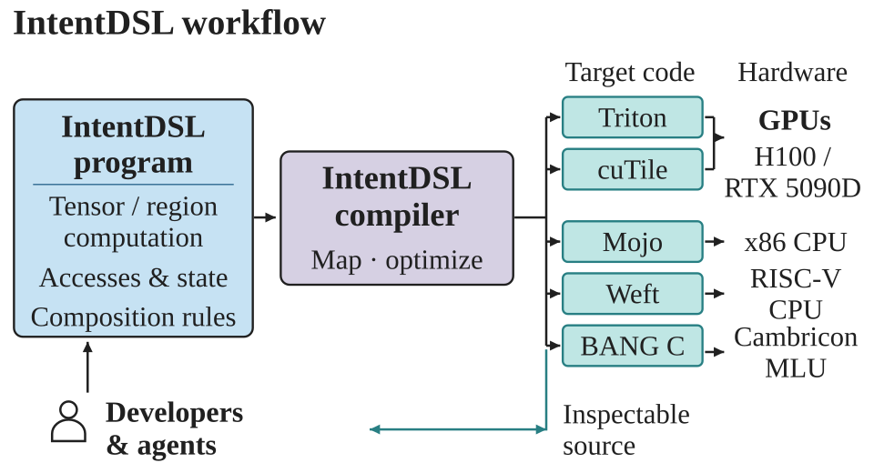

# IntentDSL

**Write an operator algorithm once. Compile it for different execution models.**

IntentDSL is a Python kernel language and compiler for GPU, CPU, and accelerator programs. You write tensor computations, logical domains, state, and explicit multi-kernel orchestration. The compiler builds the physical execution structure and lowers it through target compilers such as Triton, cuTile, Mojo, Weft, and BANG C.



- **Programmable algorithms:** reductions, contractions, indexed access, control flow, and structured region computations compose inside kernels.
- **Reusable compilation:** shared semantic analyses and execution-family passes preserve the algorithm while forming target programs.
- **Python integration:** compile a kernel into a callable, pass PyTorch tensors, and inspect the generated source and IR.

## Install

The first public setup path is **Linux + NVIDIA + Triton**, using Python 3.10–3.12 and the LLVM/MLIR 20 SDK. MLIR's Python bindings must be built for the same Python interpreter ABI. The [installation guide](environment/README.md) covers these prerequisites and the source build.

From this checkout, with an LLVM build containing the completed `MLIRPythonModules` target:

```bash
python3 environment/install_triton.py \
  --venv .venv \
  --mlir-build /path/to/llvm-build
source .venv/bin/activate
python examples/softmax.py
```

The installer installs the MLIR bindings, CUDA PyTorch, Triton, Intent's compiler and profiles, and the optional manual MCP. It does not require a project `PYTHONPATH`. Override `--mlir-dir` and `--llvm-dir` when the SDK is outside `/usr/lib/llvm-20`; use `--help` for the other installation options.

If the SDK, MLIR Python bindings, and backend dependencies are already installed in your environment:

```bash
python -m pip install '.[manual]' \
  --config-settings=cmake.define.MLIR_DIR=/usr/lib/llvm-20/lib/cmake/mlir \
  --config-settings=cmake.define.LLVM_DIR=/usr/lib/llvm-20/lib/cmake/llvm
```

This is a source installation. The resulting wheel includes the Intent compiler and resources, and uses the LLVM/MLIR runtime libraries from the SDK installation.

## Write and call a kernel

Save this as a Python file and run it in the installed environment. This is the same FP16 softmax algorithm used by the [existing production example](examples/kernels/normalization/softmax.py).

```python
import torch
import intent
import intent.language as I


@intent.fn
def maximum_number(lhs, rhs):
    return I.maximum_num(lhs, rhs)


@intent.fn
def softmax_maximum(values):
    return I.reduce(values, axis=0, identity=-I.inf, combine=maximum_number)


@intent.kernel
def softmax_kernel(
    x: I.In[I.f16, ("M", "N")],
    y: I.Out[I.f16, ("M", "N")],
):
    M, N = x.shape
    columns = I.domain(0, N)
    for row in I.parallel(I.domain(0, M)):
        values = I.cast(x[row, columns], I.f32)
        maximum = softmax_maximum(values)
        numerator = I.exp(values - maximum)
        denominator = I.reduce.sum(numerator, axis=0)
        y[row, columns] = I.cast(numerator / denominator, I.f16)


softmax = intent.compile(softmax_kernel, target=intent.TritonTarget())
x = torch.randn((8192, 8192), device="cuda", dtype=torch.float16)
y = softmax.run(x)
print(y.shape, y.dtype, y.device)
```

`intent.compile` creates a callable artifact. On first use, the provider compiles or loads its native specialization and selects a configuration. Calls with the same specialization reuse it; new shapes or other specialization inputs can trigger compilation or tuning again. Keep the artifact and call it from your ordinary Python wrapper. `artifact.run(...)` allocates declared `Out` tensors; `artifact(...)` accepts all runtime arguments, including outputs, in declaration order.

The target is selected on the host. Changing it does not require a device branch in the kernel, but the selected backend must support the program's operations, types, and effects. cuTile, CPU, and MLU setup and existing execution coverage are described under [GPU](experiments/gpu/README.md), [CPU](experiments/cpu/README.md), and [MLU](experiments/mlu/README.md). TileLang retains its source corpus and previous results.

Current PyTorch support is eager tensor interoperability. A general `torch.compile`, FakeTensor, or autograd adapter is not provided; backward kernels and multi-kernel call order remain explicit author code.

## Use with an agent

The installed `intent-manual` command starts a read-only stdio MCP server. For clients that accept this JSON configuration, use the absolute path to the command in your environment:

```json
{
  "mcpServers": {
    "intent_manual": {
      "command": "/absolute/path/to/.venv/bin/intent-manual",
      "args": []
    }
  }
}
```

Start with `read(id="doc/dsl/authoring.md")`, then use `api(name="intent.compile")`, `api(name="I.matmul")`, or `search(query="region_fold")`. The manual ships with the package and needs neither a checkout nor an experiment-generated corpus. It provides declarations, language contracts, and small syntax fragments; complete algorithms live in the public examples. It does not execute code or certify numerical correctness.

## Inspect and learn

- `artifact.source` contains the generated provider program; `artifact.mlir` contains the target IR. `artifact.cache_directory` locates compiler inputs, outputs, and diagnostics. `intent.generate(...)` emits source and IR without creating a callable.
- `intent.CompilationStageError.stage` identifies the failed compilation stage. Its `cache_directory`, when available, points to the diagnostic artifacts.
- The compiler is discovered from an explicit `compiler=`, then `INTENT_COMPILER`, the installed package, or `PATH`. A supplied invalid path is an error.
- [Author guide](doc/dsl/authoring.md) · [Language and compiler specification](doc/index.md) · [Algorithm examples](examples/README.md) · [Existing experiments and results](experiments/README.md)
