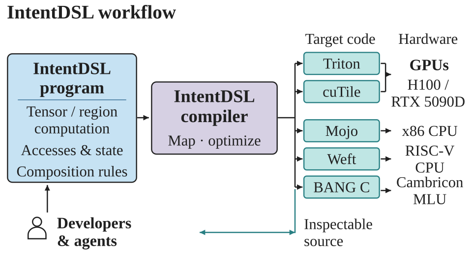
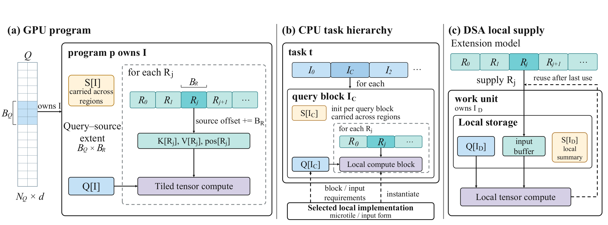

# IntentDSL

**Write an operator algorithm once. Compile it for different execution models.**

[English](README.md) · [简体中文](README.zh-CN.md)

[Documentation](https://zzyu5.github.io/Intent/en/) · [Installation](https://zzyu5.github.io/Intent/en/getting-started/installation/) · [Examples](examples/README.md) · [MCP](mcp/README.md) · [Contributing](CONTRIBUTING.md)

IntentDSL is a Python kernel language and an MLIR compiler for GPU, CPU, and accelerator programs. Authors describe tensor computations, logical domains, accesses, state, and explicit multi-kernel composition. Compiler passes form the physical program and lower it through Triton, cuTile, Mojo, Weft, or BANG C.



- **Programmable algorithms:** compose reductions, contractions, indexed access, control flow, and region computations inside a kernel.
- **Reusable optimization:** shared semantic analyses and execution-family passes organize computation, reuse, and storage; provider compilers perform their own layout and instruction lowering.
- **Ordinary Python calls:** compile once, pass tensors or native buffers, and inspect the generated source, IR, and selected configuration.

## Get started

The GPU setup uses **Linux, Python 3.10–3.12, and an NVIDIA GPU**. Source builds also need CMake, Ninja, a C++17 compiler, and the LLVM/MLIR 20 C++ SDK. See the [installation guide](environment/README.md) for SDK packages and other backends.

### Install from source

```bash
git clone https://github.com/zzyu5/Intent.git
cd Intent
python3 environment/install.py --backend triton --venv .venv-triton --examples
source .venv-triton/bin/activate
intent doctor --target triton
python -m examples.use softmax --target triton
```

The script builds and installs Intent's compiler and Python package, then installs the chosen backend's dependencies. It keeps native build artifacts outside the checkout. Use `--backend cutile --venv .venv-cutile` for cuTile in a separate environment; see [installation](environment/README.md) for external Mojo, Weft, and NeuWare toolchains.

### Install a wheel with pip

Install a wheel from a [Distribution workflow artifact](https://github.com/zzyu5/Intent/actions/workflows/distribution.yml) or your own build. Set `INTENT_WHEEL` to the actual downloaded `.whl` filename:

```bash
python3 -m venv .venv-triton
source .venv-triton/bin/activate
python -m pip install "$INTENT_WHEEL[manual,examples]"
intent setup --target triton
intent doctor --target triton
```

The distribution recipe targets **Linux x86-64 with glibc 2.35 or newer**, using `auditwheel` to repair the wheel for `manylinux_2_35_x86_64`. It includes the native compiler, optimizer, profiles, manual, and compiler runtime libraries, so installation needs no LLVM/MLIR SDK. Backend SDKs and drivers are selected separately. The package name is `intentdsl`, and its Python import is `intent`; **a public PyPI release has not been published yet**.

Build the source archive and wheel using the existing recipe:

```bash
python3 environment/build.py \
  --output-dir "$HOME/.cache/intentdsl/distribution/github-ready" --jobs 8
```

## Write and call a kernel

Save this as a Python file and run it in the installed Triton environment. It uses the same algorithm as the [ReLU example](examples/kernels/activation/pointwise.py).

```python
import torch
import intent
import intent.language as I


@intent.kernel
def relu(
    x: I.In[I.f16, ("M", "N")],
    output: I.Out[I.f16, ("M", "N")],
):
    M, N = x.shape
    columns = I.domain(0, N)
    for row in I.parallel(I.domain(0, M)):
        output[row, columns] = I.maximum(x[row, columns], I.cast(0.0, I.f16))


artifact = intent.compile(relu, target=intent.TritonTarget())
x = torch.randn((64, 1024), device="cuda", dtype=torch.float16)
y = artifact.run(x)
print(y.shape, y.dtype, y.device)
```

The kernel describes logical rows and columns. Compiler passes choose physical ownership, blocking, traversals, and storage. The target is selected on the host; the kernel does not branch on the backend.

`intent.compile` returns a callable artifact. Its first invocation can trigger native JIT compilation and autotuning; subsequent calls with the same specialization reuse that work. `artifact.run(...)` allocates declared `Out` tensors, while `artifact(...)` accepts explicit outputs. Keep the artifact in your application instead of recompiling on every call.

GPU and Mojo artifacts also provide `artifact.as_torch_op("your_project::name")` for opaque PyTorch custom operators and `torch.compile` integration. Authors register their own backward; the compiler preserves explicit kernel and host composition. See the [framework examples](examples/README.md#框架与产物调用示范).

## Explore 30 complete programs

The product examples cover attention, recurrent state, normalization, matrix and quantized contractions, sparse access, scans, and mutable updates. Each program uses the unique algorithm in `examples/kernels/` and ordinary host composition in `examples/programs/`.

```bash
python -m examples.use --list
python -m examples.use attention --target triton
python -m examples.use paged_decode --target cutile
python -m examples.use --all --target triton --stage source --jobs 4
```

| Provider | Execution route |
|---|---|
| Triton / cuTile | NVIDIA GPU; PyTorch tensor and stream integration |
| Mojo | x86 CPU; external Mojo compiler |
| Weft | CPU lowering; native execution through an explicitly configured Weft deployment |
| BANG C | Cambricon MLU; external NeuWare SDK and compatible device |

Generation, native compilation, and execution are separate stages. Backend coverage depends on the program's operations, types, effects, and selected hardware. The [examples guide](examples/README.md) describes inputs, complete calls, and target options. `experiments/` retains historical paper material; product development uses the examples.

## How the compiler is organized

```text
Python algorithm → canonical Kernel IR
                    ├─ GPU program → Triton / cuTile
                    ├─ CPU program → Mojo / Weft
                    └─ DSA program → BANG C
                  → native compilation, configuration selection, and calls
```

Passes consume typed semantics, def-use, coordinate relations, effects, and target capabilities. Execution decisions live in the current MLIR program. GPU, CPU, and DSA can reuse semantic knowledge while retaining their own execution and storage models.



*From the IntentDSL paper: three physical realizations of an author-defined region computation. See [image sources](images/README.md).*

Read the [language manual](https://zzyu5.github.io/Intent/en/), [compiler specification](doc/compiler/README.md), or [contribution guide](CONTRIBUTING.md) for the relevant entry point.

## Use with an agent

MCP has a dedicated [directory and setup guide](mcp/README.md). Both stdio servers ship with the `manual` package extra:

| Command | Responsibility |
|---|---|
| `intent-manual` | Read-only language contracts, API declarations, and minimal syntax fragments |
| `intent-compiler-mcp` | Compile a supplied program, inspect the environment, optimize supplied IR, and read artifacts |

Start with `read(id="doc/dsl/authoring.md")` and `api(name="intent.compile")` in the manual. Enable the compiler server when the agent should compile a supplied Python program. It uses the same compiler as the CLI; importing a program executes its ordinary top-level Python.

## Inspect compilation

```bash
intent compile examples/kernels/normalization/softmax.py:stable_softmax_f16 \
  --stage kir --json
intent compile examples/kernels/normalization/softmax.py:stable_softmax_f16 \
  --target triton --json
```

The CLI reports the actual compilation stage and artifact paths. In Python, use `artifact.source`, `artifact.mlir`, and `artifact.cache_directory`. Source generation and KIR inspection do not actively launch the selected kernel. See the [usage guide](https://zzyu5.github.io/Intent/en/getting-started/usage/) for installed tools and diagnostics.

## Contribute

Start with [CONTRIBUTING.md](CONTRIBUTING.md) for setup, compiler modules, pass contributions, and focused verification. Questions and reproducible problems belong in [GitHub issues](https://github.com/zzyu5/Intent/issues).

IntentDSL is licensed under [Apache-2.0](LICENSE). Bundled third-party components retain their own notices and licenses.
