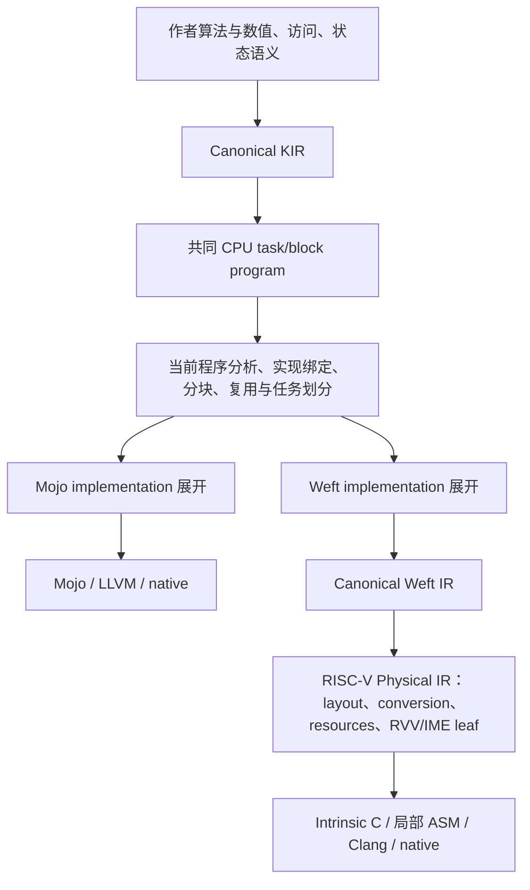

# CPU 编译器推进回顾：区域程序、IME 接入与量化优化

> 本文保留写作时的调查与测量快照；当前运行入口和结果见本实验组的 [README](../README.md)。

这份报告从最初的 CPU 可编程 lowering 讨论开始，追踪区域程序、结构优化、IME 正式接入、量化横向覆盖和物理性能优化。它回答每轮具体改变了什么、这些改动由哪层编译器承担、已经有哪些运行证据，以及哪些能力和性能仍未完成。

早期区域程序与结构优化在本次 IME 接手前已经合入 main；本次分支工作延续了这些基础。本文把历史实现、最新实测和当前判断分开，历史讨论报告中的“只生成代码”“专业实现接口尚不存在”等描述不能当作当前状态。

## 1. 当前判断

**CPU 编译器的程序表示、共享分析与 pass，以及专业实现的接入边界，都有实质完善；当前已经具有可运行的编译器形态。完善程度仍有明确边界：横向覆盖只完成了若干真实需求，性能也没有全面收敛。**

可以分成三类贡献：

| 层次 | 已落地的工作 | 这层工作的意义 |
|---|---|---|
| Intent 共同 CPU 程序 | 区域分块、遍历裁剪、状态与准备结果复用、显式输出 ownership、量化输出分组、任务划分 | 根据当前程序的轴、数值与 effects 改写外围执行程序，使同一套机制服务不同计算 |
| Intent 的 Mojo/Weft implementation | 适用性、需求、有限参数、绑定、`formTile`/`expand`；量化与整数矩阵计算展开为真实 IR | 让专家编写的局部实现参与正式 lowering，并与外围程序组合 |
| 外部 Weft physical passes 与 leaf | 有序布局交换、完整寄存器状态更新、IME fragment 累加保留、编码字节窗口供应与解码 | 保持同一程序的物理表示正确，减少转换、解码与 packing 工作 |

最近 **Q4 IME 的 20.6% 降时主要属于第三类**。第三步中新增的 `GroupQuantizedDots`、output/effect 连接则属于第一类。不能把所有收益都归为“Intent shared CPU pass 提速”。

当前还没有完成跨 RVV/IME 的实测实现择优、任意 dtype/索引/谓词加载覆盖，也没有证明所有合法形状都达到良好性能。Q4 IME 仍比同机 reference 慢约两倍。

## 2. 从最初思考到每轮实现

这里按实际实现批次回顾。handoff 中的三步路线仍是：**CPU 结构优化 → Weft IME 正式接入 → 按真实需求扩展横向覆盖**；“第三步”没有改成 DSA/Ascend。

### 最初思考：确定共同程序与专业实现的边界

`b164302d` 保存了 CPU 可编程 lowering 的讨论和规格调整。起点的问题是：共同 CPU blocking 过早带入 f32 向量微核的偏好，能力、参数和局部实现职责混在一起；新的量化或矩阵扩展难以进入同一编译过程。

确定的方向是：保留完整的 CPU task/block program，由共同层负责外层遍历、访问、复用、资源和任务；由目标 implementation 提供适用条件、输入要求、参数和局部微程序，再展开为真实 IR。CPU shaped value 不必等于 SIMD 寄存器，Weft 也不必先消费 Mojo 风格的向量展开。

依据是 [最初讨论](/home/kingdom/phdworks/intentdsl/experiments/cpu/reports/cpu-programmable-lowering-reassessment.md:7) 与 [现行 CPU 规格](/home/kingdom/phdworks/intentdsl/doc/compiler/cpu-program-ir.md:34)。前者记录当时的诊断，后者定义当前职责。

### 前置第一轮：实现机制、量化准备和区域程序成为可执行主链

`17d01824` 首先加入 implementation registry、局部展开接口和 Q4_K/Q8_K lowering，但当时 Weft 的 Q8 field store 仍不能 native 闭合。`031ab528` 才补齐 artifact/调用链并记录首次 Weft native 量化运行：6.074266 / 5.798605 ms，G/S=1.047539。

随后 `be97c258` 建立 Mojo region native 路径；`0d1d0fe1` 修正有界 segment、tail 和 contraction 初始化；`0aee6d19` 加入实现 requirements 与协调分段；`b18c14ff` 进一步共享证明和准备结果复用。它们共同形成以下基础，而非同一笔提交一次完成：

这轮形成的基础包括：

- `ImplementationRegistry` 及 `applicable`、`legal`、`parameters`、`formTile`、`expand`。共享 blocking 查询实现要求，把当前输入、输出、M/N/K 范围与初始化责任交给选定实现。
- `QuantizeOp`/`QuantizedDotOp`、Q4_K/Q8_K 的格式与数值合同、调用内 Q8 activation 准备，以及可实际调用的 Weft artifact/runtime。**这些在 IME 接手前已经存在。**
- `RegionProgram` 保存 source、identity、state、capture、output 和 summarize/combine/apply/emit 的关联。`RegionPartition` 分析可共同分段的轴，`RealizeRegions` 把决定写入实际循环、切片和状态程序。
- 共享的 uniform/区域证明、准备结果复用和私有状态连接。复用依赖相同 producer、binding、合法作用域、alias、dominance 与读写顺序，不是按算子名缓存输入。

代码入口：[实现接口](/home/kingdom/phdworks/intentdsl/include/Intent/Dialect/CPU/Transforms/Implementation.h:9)、[区域程序](/home/kingdom/phdworks/intentdsl/include/Intent/Dialect/CPU/IR/RegionProgram.h:8)、[准备结果复用](/home/kingdom/phdworks/intentdsl/lib/Dialect/CPU/Transforms/ReusePreparedInputs.cpp:90)。

这轮解决的是“算法区域、状态与局部实现能否共同形成可运行程序”。它没有完成 IME 接入，也没有让任意控制流、dtype 和访问形式都获得相同优化。

### 路线第一步：让结构知识实际减少遍历、复制和重复供应

`46f63ee0` 是结构优化主体，`c3c96b61` 保存当时的数值和性能结果，`c2726133` 已将前述两轮 CPU 工作合入 main。

具体改动是：

- **区域裁剪。** `RegionPredicates` 为受支持的 region-fold 产生 possible/all-true 区间；完整 summary、identity、数值和 effects 证明成立时，`RealizeRegions` 改写循环边界与访问，并特化已经确定的条件。当前这项区间证明不处理 region-scan；scan 的状态/复制优化有各自成立条件。
- **私有状态直接更新。** 根据逐元素映射、storage root、最后读取、dominance 与 effects，把合法 producer 直接接到 private owner，消除复制；必要的输出复制和 snapshot 保留。linear attention 两个候选的相关 `memref.copy` 总数由 12 减至 4，这是生成程序结构的观察。
- **只读供应复用。** 在合法作用域内复用输入供应，避免把子作用域的 SSA 值带到外层使用。
- **保留二维计算块。** Weft contraction 主体保留绑定驱动的有界 M/N panel，当前 panel 上限为 4；真实 K=1 尾部仍有局部标量形式。

关键依据：[区域证明](/home/kingdom/phdworks/intentdsl/lib/Dialect/CPU/Analysis/RegionPredicates.cpp:267)、[实际区域改写](/home/kingdom/phdworks/intentdsl/lib/Dialect/CPU/Transforms/RealizeRegions.cpp:227)、[私有写入融合](/home/kingdom/phdworks/intentdsl/lib/Dialect/CPU/Transforms/FuseStructuredComputations.cpp:283)。

局限也明确：`0 × unknown V` 不能单独证明整个浮点 summary 为 identity，未知 effects、依赖关系或贡献不能凭局部零值删除。这一轮没有承诺裁剪所有 mask-false 区域。

### 路线第二步：从 Intent 正式贯通 Weft IME

Intent `390150e3` 与 Weft `e73aaaac3` 完成这一步。原先“外部 Weft 能使用 IME”并不意味着 Intent 已能选中和调用该路径。

新增内容包括：

- i8 输入、i32 accumulator/output 的 CPU construction 与计算识别，正式的 `matrix_i8_i32` capability，以及 `weft.matrix_i8_i32` implementation。
- target 选择、编译参数、artifact requirement/实际 extension 校验和 native 硬件检查贯通；为 K1 的 IME 建立独立运行 profile。
- 由共享 CPU blocking 组织外围 M/N/K 范围，整数 implementation 展开有界微块，外部 Weft 再选择 IME fragment。生产程序包含 bias 等外围计算。
- 修复外部 Weft 的 lane/replica 坐标交换，使数值布局转换按照明确坐标有序 repack。
- 两个真实生产 case：M1 GEMV 与 M128 GEMM，均为 N=K=4096 的 i8×i8→i32+bias。

当前局部硬件合同是 SpaceMIT IME1、VLEN256、signed i8×i8→i32、K8/N4、active M1/M4。Intent 的整数 implementation 有限参数允许 micro-M=1/4、micro-N=4/16，并检查外层块整除；较大局部块由多个硬件 atom 组成。

入口：[Weft target](/home/kingdom/phdworks/intentdsl/python/intent/targets/weft.py:24)、[整数 implementation](/home/kingdom/phdworks/intentdsl/lib/Target/Weft/Transforms/Implementations.cpp:208)、[artifact 检查](/home/kingdom/phdworks/intentdsl/python/intent/runtime/weft/compilation.py:19)、[IME capability](/home/kingdom/phdworks/TianchenRV/lib/Target/IME/FragmentContracts.cpp:9)。

这一步接入的是计算块内的矩阵实现。CPU 程序仍拥有任务、外层遍历、准备、资源和调用接口。

### 路线第三步：让量化程序复用既有 CPU 与矩阵实现

Intent `954e009b` 与 Weft `6b8fe3e77` 完成了第三步中一个具体的横向覆盖切片：将已有 Q4_K×Q8_K projection 接到同一 IME 计算能力上。

原始量化 dot 是 rank-0 的 u4×i8→i32 统计，不能仅打开 IME 选项就满足二维 signed-i8 fragment 合同。因此做了三层修改：

1. **共同 CPU IR/pass：** `QuantizedDotOp` 采用显式 output memref 和 write effect，接入已有输出 forwarding/资源分析；`GroupQuantizedDots` 从当前 row projection、只读输入与 disjoint output 关系出发，把独立输出组成选定 implementation 要求的窗口，并保留余数尾部。Q8 准备留在输出 workset 外跨输出复用。
2. **Weft implementation：** 显式把 u4 数值扩大为 signed i8，保持 0..15；建立四个输出的矩阵轴关系，生成 Q4/Q8 numeric windows、K32/K8 局部循环、整数统计与浮点组合。
3. **外部 Weft：** 完整 register update 保持原 carrier，IME accumulator 可跨完整更新留在寄存器中；补齐 encoded field、转换结果与 fragment 消费者之间的布局传播。

关键入口：[GroupQuantizedDots](/home/kingdom/phdworks/intentdsl/lib/Dialect/CPU/Transforms/GroupQuantizedDots.cpp:35)、[真实 pass 顺序](/home/kingdom/phdworks/intentdsl/lib/Dialect/CPU/Transforms/Passes.cpp:152)、[量化展开](/home/kingdom/phdworks/intentdsl/lib/Target/Weft/Transforms/Quantization.cpp)、[寄存器累加保留](/home/kingdom/phdworks/TianchenRV/lib/Target/IME/FragmentMaterialization.cpp:289)。

Q4_K/Q8_K storage、record 内 i32 统计、`R32(d*S)`、`R32(dmin*T)`、`R32(ds*(p-n))` 及递增 record 的浮点累加顺序均保留。没有把预先合并 scale 并舍入到另一格式的外部 benchmark 当成同语义实现。

这一轮说明共同 pass 和局部计算确实可以被另一种外围程序复用。但 grouping 当前要求零起点、unit-step 的单 row parallel workset、单个 dot、精确 row subview、支配关系与独立写入；它没有完成任意 batch/transpose、复杂 alias/effect、多 dot、一般谓词加载及其他量化格式的闭合。

### 后续性能轮：减少 Q4 IME 的实际解码与 packing 工作

Weft `36393ad33` 实现优化，Intent `1c608f5c` 保存对应的最终实测。

第三步结束时，Q4 IME 已经数值通过，但完整时间为 36.298390 ms，对比同机 RVV reference 的 14.268463 ms，仍慢 2.54 倍。检查实际物理程序后，优化落在每个 K8 issue 的数据供应：

- 将四路各自 decode 后再 pack，改成四路 byte-safe window 读取后拼成 fragment，再统一 decode；Q4 操作数的移位/掩码操作由 8 次减至 2 次。
- full-valid packing 直接从首段初始化，随后插入其余行，并固定拼接 VL，减少多余清零、首段插入和 VL 切换；non-full 保留原有零填充与 active-prefix 语义。
- 用真实 `IMEFragmentWindowLoadOp`、访问 verifier 和明确寄存器临时资源表达该局部读取。融合要求同 block、one-use、无 snapshot/跨写，且 field、record、axis、layer、shift、边界和目标 LMUL 全部成立。

入口：[目标 pass](/home/kingdom/phdworks/TianchenRV/lib/Target/IME/FragmentSupply.cpp:13)、[访问合同](/home/kingdom/phdworks/TianchenRV/lib/Dialect/RISCV/IR/FragmentOps.cpp:161)、[窗口拼写](/home/kingdom/phdworks/TianchenRV/lib/Target/Emission/IME.cpp:153)、[packing 序列](/home/kingdom/phdworks/TianchenRV/lib/Target/Emission/IME.cpp:61)。

读取字节数和四路窄读取没有减少；没有增加外围 workspace、持久 repack 或改变作者算法。此前没有带来收益的 K32 staging 已删除；ABI 只保证的对齐也不足以支持直接改用宽整数读取。

最终 Q4 IME 为 **28.834295 / 14.310441 ms，G/S=2.014913**，相对 36.298390 ms 降时 **20.6%**。这支持这一组物理改动的整体收益；未为每个子改动分配独立提速比例。当前生产测量覆盖 Q4 的四行窗口，不构成所有低位宽格式或形状的性能证明。

## 3. 当前编译链及“编译器形态”的依据

判断依据不是目录或 pass 名称，而是以下实际连接：

| 判断点 | 当前证据 | 仍有的边界 |
|---|---|---|
| 当前程序是否保存执行决定 | CPU IR 保存任务、循环、输出、effects、配置和 implementation binding；Weft physical IR 保存布局、转换、资源与 selected leaf | 有限形式的分析和改写，不等于任意程序都能优化 |
| pass 是否改变执行工作 | 区域边界与切片被改写，私有复制被消除，准备跨输出复用，量化独立输出分组 | 证明不足时不能扩大改写范围 |
| 专业实现是否正式参与编译 | `Implementation` 提供适用性、合法性、参数、需求、`formTile`/`expand`，展开结果继续 legalization/verifier | 当前是 C++ IRBuilder 接口；没有任意 Weft Python kernel 的通用 importer |
| emitter 是否重新决定整体程序 | 窗口和 fragment 合同在 physical pass/IR 中确定，emitter 生成对应局部指令；CPU/provider 已形成外层程序 | 局部 leaf 的指令序列优化不应被描述成共同 CPU traversal 优化 |
| 是否真正可运行 | 已有 native artifact、硬件/ABI 校验、调用内准备与资源、有限 tuning 和实际 benchmark | native pass 只证明已运行 case 的既定数值检查通过 |
| 是否已经自动选到最佳实现 | 有限候选配置能够生成、计时、选择 winner | implementation 身份仍按注册顺序选择首个 applicable，未完成跨 RVV/IME 的实测竞争 |

最后一项有直接证据：[`ImplementationRegistry::select`](/home/kingdom/phdworks/intentdsl/lib/Dialect/CPU/Transforms/Implementation.cpp:10) 返回首个适用实现；[量化注册顺序](/home/kingdom/phdworks/intentdsl/lib/Target/Weft/Transforms/Implementations.cpp:195) 在 matrix capability 存在时优先选矩阵实现。因此目前能出现“IME 合法且数值通过，但比同机 RVV source 更慢”。已有 tuning 主要优化已选实现的有限参数，不能说成全面自动实现搜索。

与成熟实现的职责对照也支持这种分层：

| 本地参考 | Intent/Weft 对应机制 | 差异与含义 |
|---|---|---|
| TileLang [GemmMMA 局部 PrimFunc](/home/kingdom/phdworks/ref/tilelang/tilelang/cuda/op/gemm/gemm_mma.py:109) 组织局部存储、K-loop 和 MMA；[GemmNode::Lower](/home/kingdom/phdworks/ref/tilelang/src/op/gemm.cc:198) 将其 body 插回 TIR | Intent [implementation 接口](/home/kingdom/phdworks/intentdsl/include/Intent/Dialect/CPU/Transforms/Implementation.h:21) 与 [Weft implementation](/home/kingdom/phdworks/intentdsl/lib/Target/Weft/Transforms/Implementations.cpp:195) 展开真实 IR | 专业微程序可以是正式编译期 lowering；Intent 当前接口和需求协调仍较有限，CPU 不采用其 SIMT 根模型 |
| Triton [ConvertLayout lowering](/home/kingdom/phdworks/ref/triton/lib/Conversion/TritonGPUToLLVM/ConvertLayoutOpToLLVM.cpp:49) 根据 src/dst 坐标布局决定 shared-memory、shuffle 或寄存器重排 | Weft [layout pass](/home/kingdom/phdworks/TianchenRV/lib/Target/CanonicalizeRISCVLayouts.cpp:805) 选择有序 `lane_repack`，由 [局部 emitter](/home/kingdom/phdworks/TianchenRV/lib/Target/Emission/Layout.cpp:691) 拼写 | 两者都由明确布局关系驱动物理转换；Weft 处理普通 CPU 指令流中的 lane/replica，不照搬 warp/shared-memory 组织 |

## 4. 性能证据怎样阅读

所有 G/S 都是 `generated_ms / source_ms`，小于 1 表示生成程序更快。每对数值来自同次、同机、相同输入规模和外部 dtype 的完整算子比较。

早期结构优化的两项主要结果：

| 路径 | 优化前 generated / ms | 优化后 generated / ms | 优化后 source / ms | 优化后 G/S |
|---|---:|---:|---:|---:|
| Weft linear attention | 3.437264 | 1.260196 | 1.906588 | 0.660969 |
| Mojo linear attention | 0.098131 | 0.083348 | 0.154081 | 0.540938 |

前者约 2.73 倍提速，后者降时约 15.1%。Weft 优化前 source 为 1.901288 ms，前后接近。上述历史结果来自 `c3c96b61` 的 CSV 及当时结构优化记录，本次没有重新测量 Mojo。

IME 几轮结果可直接从 Git 中对应提交的 `report/baselinev2/weft-rvv.csv` 取回：

| 阶段 / 记录提交 | i8 GEMV：G / S，ms | i8 GEMM：G / S，ms | Q4 IME：G / S，ms |
|---|---:|---:|---:|
| 正式接入 `390150e3` | 399.080309 / 950.388436 | 13202.879550 / 30931.143967 | 尚未接通 |
| 量化覆盖与寄存器更新 `954e009b` | 216.160734 / 945.317117 | 7165.341122 / 30942.904630 | 36.298390 / 14.268463 |
| 窗口与 packing 优化：Weft `36393ad33`，记录 `1c608f5c` | 219.864199 / 952.642073 | 7107.961639 / 30949.878710 | 28.834295 / 14.310441 |

第三步同期 i8 也有明显改善，外部 Weft 完整 register-state 与 fragment accumulator 保留正是在该阶段闭合；这些是成组改动结果，不给某个单独 pass 分配未经隔离测量的全部收益。最近一轮主要收益在 Q4，不能把 i8 GEMV 的 216.16→219.86 ms 写成进一步加速。

测量范围与解释限制：

- i8 GEMV/GEMM、Q4 IME 在 `k1` CPU3、VLEN256；Q4 RVV 和两项 Weft attention 在 `rvv` CPU48、VLEN128。不能用两台机器的 Q4 绝对时间推导 IME/RVV 加速比。
- Q4 两侧都在 native invocation 内完成 Q8 量化及内部 workspace 分配/释放；最终外部输出分配、编译、调优、加载与 cache eviction 不计入该次算子时间。i8 同样计入调用内 packing 和资源。
- IME 的 reference 是相同算法的 Weft/RVV source；结果不代表对所有成熟 CPU 库的优势，也不是模型端到端收益。
- 数值检查通过与性能达标分开。早期 RMSNorm 为 5.019436 / 3.447934 ms，问题未在这些 IME 轮次中解决；当时生成的 Mojo source 前后无差异，不能无证据把差距归给外部 compiler。

## 5. 已经能支持的论文表述与剩余工作

目前有证据支持：**同一个 CPU 程序模型能保持区域算法与状态关系，并通过当前程序分析形成分块、复用与受证明约束的裁剪；具备明确数值合同的局部实现能够经过统一绑定机制，与不同外围程序组合，进入向量或矩阵扩展的 native 执行链。**

其中，linear attention 展示状态/供应改写如何减少实际工作；dense i8 与 Q4_K×Q8_K 展示同一矩阵计算能力如何服务不同数值和外围程序；Q4 的物理优化展示了从实际 load/decode/packing 工作量出发得到可测收益。

剩余工作应按作用区分：

1. **实现选择：** 将多个同语义、合法的实现纳入明确的选择策略。当前首个适用实现的机制不足以保证启用 IME 后更快。
2. **横向覆盖：** 更广 dtype、谓词访问、contraction 轴关系及动态/复杂 effects，需要按真实程序逐项闭合；这几轮不能代表第三步所有方向完成。
3. **物理效率：** Q4 仍有四路窄读取、拼接及矩阵 atom 利用率问题；当前没有减少其动态读取数量。进一步优化需要先证明减少了什么工作，不能仅新增 IR/op。
4. **性能论证：** Q4 IME 仍约为同机 reference 的两倍；RMSNorm 的既有差距仍在。现有单核 Weft、单 NUMA 八核 Mojo 结果不能外推到全部规模、多核扩展或其他 ISA。

## 6. 本次合并与主线核对

2026-09-12 已完成本地合并：

| 仓库 | 合入内容 | main 结果 |
|---|---|---|
| IntentDSL | `cpu-weft-ime` 的 `390150e3`、`954e009b`、`1c608f5c` | merge commit `0b219ff4`；保留原 main 的并行 frontend/GPU/agent 实验工作 |
| 外部 Weft | `intent-ime-integration` 的 `e73aaaac3`、`6b8fe3e77`、`36393ad33` | fast-forward 到 `36393ad33` |

两次合并都没有冲突，没有 push 或改写历史。早期 CPU 区域/结构优化已经在 `c2726133` 合入，未重复合并。

合并后的 Intent 编译器已从当前 main 完整构建，构建目录为 `/home/kingdom/.cache/intentdsl/cpu-weft-main-build`，使用 LLVM/MLIR 20、外部 Weft main 的源文件及匹配的 `weft-ime-build`。Weft 编译器沿用已合入该 main 的相同实现。

主线生产核对复用现有 Weft registry 的全部六个 case，准备并行、计时串行；六项均通过原有数值检查。完整结果已写入 [Weft 性能表](/home/kingdom/phdworks/intentdsl/experiments/cpu/results/weft-rvv.csv)：

| 算子 | Generated / ms | Source / ms | G/S | 数值检查 |
|---|---:|---:|---:|---|
| i8 GEMV+bias，M1/N4096/K4096 | 211.679499 | 950.075602 | 0.222803 | pass |
| i8 GEMM+bias，M128/N4096/K4096 | 7095.383065 | 31131.760440 | 0.227915 | pass |
| Causal attention，B8/S128/D32 | 3.385265 | 109.337088 | 0.030962 | pass |
| Causal linear attention，B8/S128/D32 | 1.237515 | 1.906728 | 0.649025 | pass |
| Q4 RVV，N4096/K4096 | 5.942076 | 5.207812 | 1.140993 | pass |
| Q4 IME，N4096/K4096 | 28.652463 | 14.300742 | 2.003565 | pass |

这是合并后的新测量，不覆盖第 4 节的历史快照，也不构成一轮新的优化。两条 Q4 路径的完整 generated `kernels.c` 与 `host.c` 和合并前分支逐文件比较均无差异；本轮 Q4 RVV 选中 chunk=64，上轮最终运行选中 chunk=32，Q4 IME 的选择则相反。有限 tuning 选择与实测数值有变化，不能把这次 Q4 RVV 的较慢结果归因于未经观察的合并代码改写。

本次没有修改 CPU/Weft 规格或新增独立测试，也没有把 GPU/agent 实验成绩算入 CPU 结果。当前 main 上保留的是已合并实现、这一份回顾报告与本次生产实测。
