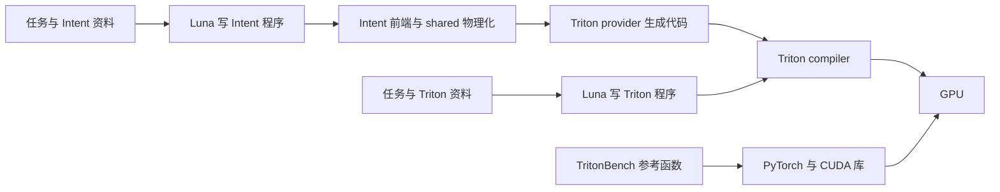

# IntentDSL TritonBench 第一阶段：协议、性能差距与设计判断

本报告回答四个问题：实验是否单轮、时间与配置来自哪里、问题属于编译器哪一层、当前结果是否否定了更简单 DSL 的设计价值。依据是现有代码、冻结候选与实测数据。本轮报告工作不修改 compiler、不启动新的实验批次、配置搜索或算子测试；此前已启动的第三批后台进程仍在执行。

分析日期：2026-09-12。代码改动统计截至 `995b166e`；完整定量分析使用已完成的第二批 `first-stage-validation` 及其开发复测。第三批仍在运行，仅引用明确标注的个案，不据此计算最终总体成绩。

第二批记录的环境为 NVIDIA GeForce RTX 5090 D、PyTorch `2.10.0+cu130`、Triton `3.6.0`，模型为 `gpt-5.6-luna`、reasoning effort=`max`。下述数字只对既定 50 题的单个 profile 和该环境成立。[环境与输入合同](/home/kingdom/.local/share/intentdsl/agent-evaluation/first-stage-validation/environment.json:6)

## 1. 先把四个问题回答清楚

1. **Luna 没有生成 ref。** Luna max 分别生成 Intent 程序和直接 Triton 程序；ref 来自 TritonBench 的 Python/PyTorch 参考实现。单轮指每题每语言一次正式提交、提交后不反馈修改，不指一次模型 API 返回、一次文件编辑或一个物理配置。实际已经启动三批独立生成，整个开发过程不能称为一次固定系统的无反馈盲试。
2. **用户感受到的长时间，和表中算子耗时，是两种时间。** 生成通常花数分钟，包含模型推理、资料查询、编辑和服务等待；JIT/tuning 通常发生在正式计时之前。表中的微秒/毫秒是热态 GPU 算子时间，慢十几倍的归约不是把 JIT 算进去了。
3. **已证实的自身缺陷主要在前端/KIR，以及 shared 层的分析和物理化 passes。** 访问关系、分块、ownership、SSA 重算与定义性证明均暴露了问题；provider 也有资源约束、合法化和配置问题。`source/` 中的完整手写 kernel corpus 没有被 Intent 生成路径自动调用，不能把它们的性能视作已被编译器继承。
4. **简洁 DSL 不会自动消除优化决策。** 它把部分决定从作者转交给 compiler；只有信息保留、物理化策略、目标能力和作者算法组织都足够好，简洁表达才会变成高效程序。当前数据没有证明整体性能优势，但也没有证明 DSL 设计在原理上行不通。它更明确地暴露了实现成熟度、默认程序组织和可用性上的不足。

当前不能用“任务太简单”解释整体落后。第二批的 pointwise 表现已接近直接 Triton，最严重的短板反而集中在归约及带全局归约的组合任务。

## 2. 三个比较对象，以及“单轮”的准确含义

| 对象 | 谁写程序 | 实际执行链 | 本实验中的作用 |
|---|---|---|---|
| Intent | Luna max 写原始 Intent 与 host 编排 | Intent frontend/KIR → shared GPU passes → Triton provider → generated Triton → Triton compiler → GPU | 被评测方案 |
| 直接 Triton | Luna max 写 Triton kernels、参数和 host 编排 | agent Triton → Triton compiler → GPU | agent 编程对照组 |
| ref | 上游 benchmark 作者；存在下述一项显式纠错 | Python/PyTorch → PyTorch CUDA kernels、cuBLAS/cuDNN 等实际库路径 | 数值 oracle 与性能参照 |

另外，项目外的 `ref/triton`、`ref/tilelang` 是用于研究成熟编译器机制的源码仓库；它们与表中的 TritonBench **ref 耗时**不是同一个概念。

因此，当前比较的是两套完整工作流。直接 Triton 组也使用了成熟的 Triton 编译器；其好性能并不是一个 agent 独自替代了底层编译器。

### 2.1 单次提交中实际允许什么

- agent 可读取任务与语言材料，调用只读手册 MCP，并在提交前编辑草稿；允许多个 kernels 和显式 host 编排。
- 正式响应只有 `submit`。evaluator 收到提交后才取候选并编译、校验和计时，没有把 benchmark 错误或性能送回该 agent 改答的回合。
- 规则禁止独立测试/benchmark。shell 没有被完全禁用，现有 `agent.json` 也没有完整 shell 历史，因此能确认协议和 runner 的反馈边界，不能把它夸大成“逐条审计证明 agent 从未执行过额外命令”。
- autotune 的多个配置和计时重复属于 evaluator 执行准备，不是多个 agent 答案。

依据：[提交响应与执行入口](/home/kingdom/phdworks/intentdsl/examples/repro/agent_study/agent.py:97)、[提交后编译评测](/home/kingdom/phdworks/intentdsl/examples/repro/agent_study/__main__.py:54)、[作者规则](/home/kingdom/phdworks/intentdsl/examples/repro/agent_study/instructions.md:36)。

### 2.2 三批实验不能混成一次，也不能挑每题最好结果

固定的是 **50 题 × 2 个语言组 = 每批 100 次预定生成评测**。第一、第二批已完成；第三批是重新启动的独立生成。环境补位目录只用于没有正式提交的环境失败；真实生成超时和已提交失败不能作为补位理由。

开发复测使用原始候选，改的是 compiler/工具后重新评测；它与重新生成一整批程序不同。三批之间使用前批发现来修改 compiler 和手册，已经存在系统开发层面的反馈，不能称为完全独立于这些 50 题的未见任务验证。也不能合并三批、逐题选最快或最正确的一份来报告单次成绩。

39/50、42/50 是该批固定任务上的观察通过率，不是某一题重复生成的成功概率；系统在批间改变，也不能把三批当成同一条件下的重复抽样，声称已经确定谁的生成成功概率更高。

此前持续追加完整验证批次，使任务从实验收尾扩成了开发循环；这是实际的范围扩张。后续必须先收束当前批次和评价口径，而不是继续生成直到得到正面结论。

### 2.3 ref 还有一个需要公开的例外

通常由 runner 直接载入外部 benchmark 函数，不由 Luna 生成。上游 `sub_gelu` 的非近似分支少了标准 GELU 中的 `1 +`；现有 suite 对它启用了 `sub_gelu_standard_gelu` 纠错，候选与 reference 都按标准 GELU 任务合同评估。这个 ref 的性能也是纠正版公式的时间，应明确披露，不能称为完全未改的上游 golden。

依据：[reference 加载与纠错分支](/home/kingdom/phdworks/intentdsl/examples/repro/agent_study/tasks.py:78)、[纠错实现](/home/kingdom/phdworks/intentdsl/examples/repro/agent_study/reference_corrections.py:4)、[上游缺失项](/home/kingdom/phdworks/ref/tritonbench/data/TritonBench_T_v1/sub_gelu.py:20)。

ref 是正确性与性能参照，不是性能最优证明。某些参考函数依赖高度优化的库 GEMM；另一些由多个 eager PyTorch 操作组成，候选融合后可以减少 kernel 和中间搬运。因此“快于 ref”与“快于最优实现”也不能混用。

## 3. 时间长在哪里，config 到底是谁生成的

### 3.1 时间口径

第二批现有记录给出了以下量级。生成的配对统计使用双方均正式提交的 48 对；准备阶段统计使用各组通过的任务，集合不同，只用于区分时间量级。

| 时间 | Intent 中位数 | 直接 Triton 中位数 | 是否属于表中的算子耗时 |
|---|---:|---:|---|
| agent 生成，48 对 | 245.06 s | 239.58 s | 否 |
| agent 生成，全 50 题，含真实超时 | 265.07 s | 245.07 s | 否 |
| 整次准备及评测的墙钟时间，通过项 | 2.75 s | 1.36 s | 不是单次算子时间 |
| precompile，通过项 | 1.63 s | 0.73 s | 否 |
| autotune，通过项 | 0.257 s | 0 s | 否；Triton 组很多程序用固定配置 |
| 正式热态算子时间 | 微秒至毫秒，逐题不同 | 微秒至毫秒，逐题不同 | 是 |

第二批 100 个生成任务的 `generation_seconds` 相加约 **8.44 小时**。这是任务时间之和，存在并发，不能直接当作墙钟时间。但与每题通常数秒的准备阶段相比，足以说明长时间不能主要解释为正常 JIT。还应计入额外批次、容量失败等待、300 秒评测超时和穿插的开发复测；目前没有完整活动时间账本，不能给这些部分编造百分比。

`benchmark_timeout=300s` 约束的是准备、排队或执行等整段流程。没有有效 `candidate_ms` 时，不能把 300 秒当作 kernel 时间，更不能与修复后的微秒时间相除声称巨大加速。

正式计时先完成编译、tuning、一次既定容差检查和预热，再测量 candidate/reference，交换顺序后再测并汇总。每次样本前还进行计时窗口外的 L2 flush。当前 suite 的 46 题使用 CUDA Graph，4 题使用 CUDA event：`rsqrt` 和三个线性代数任务。

Graph 指标是捕获后的 GPU replay 时间：包含该算子的全部 GPU kernels 和中间 GPU 处理，排除 capture、Python 编排和捕获时的 allocation。Event 路径不是完整 CPU 墙钟计时，但 host 发射不及时造成的 GPU 空闲间隔可能进入 event 窗口。二者都不能直接冒充真实应用的冷启动或完整 host 端到端延迟。

依据：[准备与计时阶段](/home/kingdom/phdworks/intentdsl/examples/repro/agent_study/benchmark.py:95)、[CUDA Graph/Event 窗口与 L2 flush](/home/kingdom/phdworks/intentdsl/examples/repro/common/support.py:16)、[配对评测](/home/kingdom/phdworks/intentdsl/examples/repro/v2/measurement.py:277)。

### 3.2 配置来源

| 对象 | config/算法来源 | 实验端执行什么 |
|---|---|---|
| Intent | compiler 根据 typed program、默认 shared/provider profile、合法性约束生成有限配置 | Triton autotuner 在允许的配置中实测选 winner |
| 直接 Triton | agent 在代码中写固定参数，或写 `triton.Config` 列表和 autotune | 有 autotune 时施加同样的每 kernel 上限；固定参数就没有配置搜索 |
| ref | PyTorch 算子实现及底层库的默认策略/内部启发式 | runner 不替它生成一套相同的 Triton config 集合 |

**Intent 使用了默认候选表，不是一个固定默认值。** `ProgramContext.compile()` 没传 `tuning_config`；public pipeline 只有收到显式覆盖文件时才追加对应选项。默认表先按程序物理结构、参数角色、合法性和相关性形成完整 tuples，再交给 Triton。开发期间这些 passes/profile 有过修改，因此不同批次也不是完全相同的默认系统。

配置上限是 **每 kernel 最多 16 个**，不是每个完整算子 16 个。合法性筛选后超过上限时，均匀取列表位置并包含首尾；不会自动保证保留最佳配置。多 kernel 程序可以分别调优。两组没有统一候选集合，也没有统一总调优耗时，因此当前成绩包含作者配置选择与 compiler 候选覆盖的影响。

例如，第二批 matmul 中，Intent 声明并测了 15 个配置，直接 Triton 声明并测了 11 个；第二批 exp 中，Intent 从 32 个声明配置测了 16 个，直接 Triton 使用固定配置。统一“最多 16”不等于两组搜索了同一个空间。

reference 侧显式关闭了 PyTorch matmul/cuDNN 的 TF32 开关以及 `cudnn.benchmark`；这不意味着底层库没有自己的实现选择，也不意味着 agent Triton 代码中的精度选项自动与 reference 相同。每题配对使用同一固定输入合同，dtype 由原 profile 决定；例如 matmul、asin 是 fp16，许多其它题为 fp32，并非全套统一 fp32。

依据：[compile 不传覆盖文件](/home/kingdom/phdworks/intentdsl/examples/repro/agent_study/program.py:30)、[默认与 override 规则](/home/kingdom/phdworks/intentdsl/doc/compiler/physical-parameters.md:18)、[配置采样和调优计时](/home/kingdom/phdworks/intentdsl/examples/repro/agent_study/program.py:122)、[reference 后端设置](/home/kingdom/phdworks/intentdsl/examples/repro/agent_study/benchmark.py:65)。

## 4. 性能和 agent 成本目前实际说明什么

### 4.1 正确性与性能分开

第二批冻结首次记录为 **Intent 39/50、Triton 42/50**。现有开发汇总为 **44/50、42/50**；其中 Triton 行沿用首次记录，并未在最终 harness 下全部重新评测。新增通过的五份 Intent 原程序是 `conv2d`、`gelu_conv2d`、`relu_conv2d`、`solve`、`fused_cholesky_solve`；它们没有经 agent 反馈改写。

这证明了具体系统缺陷被修复，以及这些原始程序现在能通过相应评测。它不能把首次成绩改写为 44/50，也不是“修复后在未见任务上的一次生成正确率”。

**失败标签不能直接当作责任判定。** 例如第二批 Triton `max` 标为 `agent_program_error`，实际首先在 `candidate_load` 被 harness 的 Torch API 白名单拒绝，尚未执行 kernel。后来 `d6687246` 才允许 `torch.return_types.max/min` 返回容器。不过该候选还写了双参数构造 `torch.return_types.max(values, indices)`；第三批另一份使用相同构造形式的程序实际报过 `constructor requires a sequence`。因此既不能把第二批首次错误全归于 Triton 编程能力，也不能假定放开白名单就会通过；固定分母与原始记录应保留，最终复测需区分工具拦截和后续程序错误。[第二批首次诊断](/home/kingdom/.local/share/intentdsl/agent-evaluation/first-stage-validation/max/triton/measurement.json:12)、[原始构造调用](/home/kingdom/.local/share/intentdsl/agent-evaluation/first-stage-validation/max/triton/candidate.py:100)、[第三批构造错误](/home/kingdom/.local/share/intentdsl/agent-evaluation/first-stage-final-max-recovery/max/triton/measurement.json:12)

开发复测中双方共同通过的同一组 39 题，逐题计算耗时比后统计如下。小于 1 表示分子更快；ref 使用各组配对实测值。

| 比较 | 中位数 | 几何平均 |
|---|---:|---:|
| Intent / agent Triton | 1.008 | 1.881 |
| Intent / ref | 0.996 | 1.544 |
| agent Triton / ref | 0.830 | 0.812 |

Intent 在 15/39 题更快，24/39 题不超过 Triton 耗时的 1.1 倍；另有 11/39 题超过 2 倍，其中 7 题超过 5 倍。中位数接近不能遮住这批严重慢项。

数据：[第二批首次结果](/home/kingdom/.local/share/intentdsl/agent-evaluation/first-stage-validation/results.csv)、[开发复测结果](/home/kingdom/.local/share/intentdsl/agent-evaluation/first-stage-validation-recheck/results.csv)。失败仍属于固定 50 题的正确性分母；性能表只使用双方均通过的对应项。

### 4.2 按任务族看，比一个总均值更能定位问题

| suite 分类 | 题数 | 第二批首次通过 I/T | 开发后通过 I/T | 共同通过题 | Intent/Triton 中位数 | 几何平均 |
|---|---:|---:|---:|---:|---:|---:|
| pointwise | 15 | 15/14 | 15/14 | 14 | 0.987 | 0.960 |
| reduction | 10 | 8/9 | 8/9 | 8 | **15.410** | **8.234** |
| contraction | 7 | 6/7 | 7/7 | 7 | 1.001 | 1.941 |
| linear algebra | 3 | 0/1 | 2/1 | 1 | 1.948 | 1.948 |
| fusion | 10 | 6/7 | 8/7 | 6 | 1.011 | 1.420 |
| indexing/layout | 5 | 4/4 | 4/4 | 3 | 1.006 | 1.367 |

分类采用既定 suite 标签，不等价于严格的硬件复杂度分类，也不是 compiler 的算子名称策略。线性代数只有一个共同通过项，不能据此推广到该类全部任务。

最明显的短板是归约；contraction 的均值还被带全局归约的 `symmetric_mm_and_abs_sum` 严重拉高。简单 pointwise 并没有普遍输给直接 Triton。当前数据不支持“因为题目太简单，所以 Intent 才整体落后”的解释。

以下第二批开发汇总中的代表项均为**完整算子 GPU 耗时，单位 μs**。ref 分别列出与两组配对测得的时间，避免把不同时刻的 reference 当成同一次观测；它们不是额外的一组 agent 程序。

| 任务 | 编译所得 Intent | agent Triton | ref，Intent 配对 | ref，Triton 配对 |
|---|---:|---:|---:|---:|
| matmul | 18.208 | 18.192 | 18.176 | 17.488 |
| conv2d | 39.648 | 67.376 | 34.592 | 34.592 |
| gelu_conv2d | 77.952 | 26.272 | 34.464 | 34.464 |
| relu_conv2d | 48.928 | 14.040 | 34.560 | 34.440 |
| permute_copy | 16.128 | 5.920 | 5.896 | 5.920 |
| exp_mean | 124.704 | 7.952 | 14.304 | 14.304 |
| logsumexp | 208.688 | 8.752 | 28.512 | 28.752 |
| symmetric_mm_and_abs_sum | 8048.400 | 75.552 | 76.568 | 77.560 |

### 4.3 代码更短，但生成时间没有显示整体优势

在双方均正式提交的 48 对中，源码按非空、非单独注释行统计：

| 度量，中位数 | Intent | 直接 Triton |
|---|---:|---:|
| 作者源码行数 | **27.5** | **59** |
| 模型 output tokens | 9599 | 10797 |
| 累计 input tokens | 640556.5 | 191930.5 |
| 其中未缓存 input tokens | 74484.5 | 33124.5 |
| 生成秒数 | 245.06 | 239.58 |

Intent 有 40/48 对源码更短、29/48 对输出 tokens 更少；逐题生成时间比的中位数为 1.004、几何平均为 1.026，没有整体生成时间优势。两个 Intent 真实生成超时不具备完整 usage，不能把缺失 token 数填成 0；前面的全 50 题时间表已保留它们。

input token 数是多次请求累计的上下文输入，包含重复前缀和大量缓存读取，不是独特材料长度或金额。Intent 手册 MCP 调用中位数为 38.5，但现有记录没有对称统计 Triton 的 shell 材料读取，不能把 Triton 的 manual_calls=0 理解为没有查资料。

短源码至少有两种来源，不能混淆：

- **同等工作表达更省。** 第二批 matmul 的 Intent 为 27 行，Triton 为 143 行；开发记录中完整算子为 18.208/18.192 μs，性能接近。这是 DSL 抽象价值的具体正面信号。
- **少写了算法组织。** 第二批 exp-mean 为 23/40 行，但完整算子为 124.704/7.952 μs。更短的 Intent 没有表达 Triton 已有的 partial/combine，不能把少写的这部分全部解释为表达效率提高。

这些数据测到的是“当前模型、资料和实现组合的首次交付表现”。预训练熟悉度、资料组织、API 学习成本与 compiler 成熟度没有被单独控制；因此代码长度、正确率、生成成本和性能不能互相替代。

## 5. 编译器到底改了什么，问题在哪一层

从本次 goal 开始到 `995b166e`，共 42 个提交，其中 27 个触及编译器、前端或运行时；相关净 diff 覆盖 **25 个文件，新增 3019 行、删除 583 行**。类别有交叉，27 不代表 27 项独立性能优化。这已经是较大的核心改动。

| 层次 | 已观察到的问题与修复 | 能得出的判断 |
|---|---|---|
| frontend / canonical KIR | 索引 view 的 value/relation、reshape extent identity、控制流 index carry、nested parallel、Out 先定义后读 | 合法表达和信息保留存在实现缺口，影响可编译性/正确性 |
| shared analysis 与物理化 passes | 多轴/成对 contraction、访问组合、full coverage、K 分块、ownership、昂贵 SSA 重物化 | 本轮主要结构性缺陷所在，既有错误判定，也有不好的执行结构 |
| Triton provider 与配置 | descriptor 资源界限、gather 合法化、FP32 调度候选、ABI 参数与 view 合同 | 目标合法性与候选质量有问题；需要与 shared 结构问题分开 |
| runtime / evaluator | materialization、调优 hooks、配对 timing、合法 host 返回容器和资料路径 | 影响实验有效性，不能记作 compiler 性能优化 |

shared 的“表示模型”与“pass 不够好”也不是同一个判断。多项修复是复用已有 typed carrier，正确保存或消费 shape、坐标、effect 和 def-use；另一些是在事实已经存在时选择了错误的分块或 replay。现有证据不足以宣布整个 shared IR 架构失败，更不支持靠增加一层或重命名目录解决问题。

还存在**手册自身的责任**。本轮开发前 `ef99bb8b:doc/dsl/authoring.md` 的归约说明写着“没有 `keepdim`；需要保留一维时显式 reshape”，没有交代完整归约的 scalar 例外。第二批冻结材料已补“scalar 不能 reshape”，但直到后续 `7f1e73dc` 才明确写出“所有轴都被归约，结果是 scalar，而非零维 tensor”。所以早期相关失败存在资料歧义这一影响因素；不能只拿今天修正后的说明，倒推当时必然是 agent 没遵守清晰规则。具体候选是否受此影响还需结合当时读取的材料判断，不能反过来断言它们全由文档导致。[当前澄清位置](/home/kingdom/phdworks/intentdsl/doc/dsl/authoring.md:27)

### 5.1 如果 leaf 指完整手写 source corpus：它没有自动进入这条路径

Intent 的 `ProgramContext.compile` 调 `intent.generate`，frontend 生成 KIR，经 `intent-compile` 的 shared passes 和 Triton provider 生成代码。这里没有按任务名称从 `source/triton` 选择完整 kernel。`load_source()` 只允许直接 Triton 分支读取相邻的生成文件，也不是 source corpus 自动派发。

如果 leaf 指目标原语/数学实现，则 `tl.dot`、`libdevice.exp` 等确实参与最终执行。这些原语可以高效，但修复不了上游重复三次 GEMM、错误物理分块或不足的并行度。

依据：[compile/load_source 边界](/home/kingdom/phdworks/intentdsl/examples/repro/agent_study/program.py:30)、[生成链路](/home/kingdom/phdworks/intentdsl/python/intent/compiler/pipeline.py:34)、[shared pass 顺序](/home/kingdom/phdworks/intentdsl/lib/Dialect/GPU/Transforms/Passes.cpp:164)。

现行设计允许目标原语或 micro-kernel 承接已经闭合的语义与物理操作；它不要求通用 IR 重建所有机器细节。但包含 grid、循环、workspace 或多个 launches 的完整手写实现，不会因为叫 leaf 就自动成为合法替换。必须明确其粒度、数值、effects 和调用边界。

### 5.2 四个案例说明：不能全部怪 compiler，也不能全部怪 agent

**静态大 K：明确的 shared blocking 缺口。** 第三批 Intent 作者已经写了 linear/relu 与 LayerNorm 两个 kernels，compiler 仍曾把完整静态 K=4096 当作一次巨型 dot 的片段，导致评测超时。修复后，原程序通过，完整算子 122.656 μs；agent Triton 为 106.144 μs，ref 两组为 67.056/65.680 μs。这里不应要求作者改为动态 shape 来迁就 compiler，也没有原始 kernel 时间可用于计算加速倍数。[分块修复](/home/kingdom/phdworks/intentdsl/lib/Dialect/GPU/Transforms/RealizeContractionBlocking.cpp:2516)、[开发实测](/home/kingdom/.local/share/intentdsl/agent-evaluation/first-stage-final-recheck/fused_layer_norm_relu_linear/intent/measurement.json)

**旧单 kernel LayerNorm：compiler 缺陷与作者边界同时存在。** 同一个 matmul SSA 被 mean、variance 和最终输出消费，shared replay 曾重复生成三次 dot；保留昂贵 producer 是 compiler 应做的修复。但保留后旧程序仍约 1.653 ms，而该批直接 Triton 为 0.110 ms、ref 约 0.067 ms。旧 Intent 融合整个 GEMM 与行归约，直接 Triton 则分两阶段，剩余差距不能继续全按“leaf 没调好”解释。也不能把这个旧单 kernel 的判断套到后来已经分成两个 kernels 的候选上。[replay 策略](/home/kingdom/phdworks/intentdsl/lib/Dialect/GPU/Transforms/RealizePointwiseBlocking.cpp:1512)、[第一批复测数据](/home/kingdom/.local/share/intentdsl/agent-evaluation/first-stage-recheck/results.csv)

**全局 exp-mean：算法组织叠加当前物理映射。** 第三批固定输入为 1048576 个 f32 元素。Intent 一个 kernel、一个 program 内分块遍历并归约，124.592 μs；Triton 显式分配 partials、用两个 kernels 做 partial/combine，7.840 μs；两组 ref 为 14.288/14.352 μs。两者还有 `libdevice.exp` 与 `tl.exp` 数学路径差异。一个更快的局部 exp 原语不能代替缺少的全 GPU 并行组织；有限配置调优也不能把一份结构自动改成另一份 host 程序。[Intent 原程序](/home/kingdom/.local/share/intentdsl/agent-evaluation/first-stage-final-remaining/exp_mean/intent/candidate.py:7)、[生成的单 program](/home/kingdom/.local/share/intentdsl/agent-evaluation/first-stage-final-remaining/exp_mean/intent/exp_mean_kernel.py:42)、[直接 Triton 两阶段](/home/kingdom/.local/share/intentdsl/agent-evaluation/first-stage-final-remaining/exp_mean/triton/candidate.py:6)

这不是说任何单 kernel 归约都必然只能使用一个 CTA；这里确认的是当前候选的实际映射。跨 CTA 协作等机制是否可用，要另有语义、目标支持与完整执行证据，不能凭一个 `num_ctas` 参数或某段参考源码就当作本问题已经解决。

**symmetric-mm + abs-sum：严重差距不能被一项平均数隐藏。** 第二批 Intent 为 8048.400 μs，直接 Triton 为 75.552 μs。候选在是否利用对称性、计算 workset、partial 与最终归约上不同；Intent 当前完整乘积加全局归约还导致很低的物理并行度。必须分别计算实际工作量和检查生成结构，不能把约 106.5 倍全叫 compiler 质量差，也不能以“作者算法不同”就宣布当前系统表现合格。[第二批 Intent](/home/kingdom/.local/share/intentdsl/agent-evaluation/first-stage-validation/symmetric_mm_and_abs_sum/intent/candidate.py:19)、[第二批 Triton](/home/kingdom/.local/share/intentdsl/agent-evaluation/first-stage-validation/symmetric_mm_and_abs_sum/triton/candidate.py:50)

对照成熟实现时，Triton matmul 教程把 tile、K 循环、mask 和 accumulator 写进程序；Intent 需要由 shared passes 形成这些事实，再交给相同的下层 compiler。现行 Intent 规格同时要求一个作者 kernel 对应一次 launch，禁止暗中生成第二个 kernel。[Triton matmul](/home/kingdom/phdworks/ref/triton/python/tutorials/03-matrix-multiplication.py:233)、[Intent kernel/host 边界](/home/kingdom/phdworks/intentdsl/doc/programming-model/kernel-and-host.md:15)、[物理结构与参数的分工](/home/kingdom/phdworks/intentdsl/doc/compiler/physical-parameters.md:54)

## 6. 从设计出发，为什么简单 DSL 没有自动赢

算子时间取决于实际计算量、可利用的并行资源、数据搬运与复用、局部实现效率、同步和 launch 开销；它与源码行数没有单调关系。更短的表达可以描述同样的好算法，也可以只描述一个尚未作出关键优化选择的数学程序。

在相同数值语义、算法和 kernel 边界能够由两种语言表达时，Intent 最终也生成 Triton，原理上没有“必然比 agent Triton 慢”的障碍。达到相当性能，要求 Intent 的 compiler 能形成相当的访问、blocking、ownership、reuse 和目标参数。静态 K 与重复 dot 的问题，正说明这部分实现尚未足够成熟。

但如果两份源程序选择的算法或 kernel 边界不同，不能要求 compiler 忽略语义契约，把一份程序改成另一份。当前设计明确把多 kernel/host 编排留给作者；如果期望普通单 kernel 数学表达自动获得整算子算法分解，那是另一种设计承诺，需要先明确改变职责，不能靠逐题补 pass 暗中实现。

这里仍有 DSL 自身的可用性责任。简洁的整域表达容易让作者把整个算子写进一个 kernel；严格的 scalar/tensor、index dtype、domain identity 和 effect 规则又增加了学习负担。不能每遇到慢程序就说“agent 没选好算法”，而不检查默认写法、材料组织和 API 是否让高效且合法的写法容易形成。反过来，已有 partial/combine 提示也不代表再增加更多文档就一定有效；本批已经表现出较高的手册查询成本。

当前证据更支持下面的判断：

- DSL 在规则的成熟路径上已有价值：例如 matmul 的源码显著更短而性能相当；pointwise 的整体表现也接近直接 Triton。
- 更复杂组合暴露了 compiler 的合法表达覆盖和物理结构缺陷；修复这些是有价值的工程成果，不应回避。
- 全局归约及过度融合暴露了作者组织、抽象界面与当前 compiler 能力之间的不匹配；这不是纯粹换一个更快 leaf 就能解决的问题。
- 模型对 Triton 的熟悉度和两组材料的组织不同，是尚未分离的影响因素；不能据此断言模型偏好、背诵或某个 DSL 天生更适合 agent。

这套 50 题中只有 15 个 suite pointwise，另有 4 个明显逐元素 fusion；其余包含归约、GEMM/卷积、线性代数和索引布局。短小的全局归约代码也可能需要复杂的高性能组织。每题只测一个既定 profile，例如 exp-mean 此次是 2^20 元素；不能把上游 profile 脚本中的整个尺寸范围说成本实验已经覆盖的范围。

因此，换成“更难的任务”不会自动证明设计优势。当前最应回答的是：在现有固定任务中，哪些优化决定确实被 DSL 有效省掉，哪些只是被隐藏或遗漏，哪些本应由 compiler 承担却没有做好。

## 7. 下一步应先做的宏观决定

首先区分三种主张，避免一个性能表同时替它们作证明：

| 想证明的主张 | 当前实验能观察什么 | 还不能直接推出什么 |
|---|---|---|
| 当前工作流一轮交付更容易 | 首次提交率、正确率、生成时间与 tokens、作者源码 | 纯粹由 DSL 设计引起的因果优势 |
| compiler 能生成有竞争力的程序 | 同题完整算子性能、合法程序的修复后表现 | 不同算法/精度/配置空间下的纯 compiler 代码质量排名 |
| 简化表达没有牺牲优化能力 | 同算法、同 kernel 边界的具体可比案例 | 所有简短数学表达都自动获得最佳整算子算法 |

建议按现有“可编程算子 DSL，作者组织算法，compiler 负责语义保持的物理化”契约收敛，而不是现在扩成自动整算子算法规划器：

1. **不再追加独立生成批次来寻找正面结果。** 先收束已启动的固定批次，保留全部首次失败和环境补位依据。
2. **把最终 compiler 状态与开发过程成绩分开。** 现有开发 CSV 是不同修复节点的汇总，并非最终版本下的一次统一全量冻结复测；完成固定原候选的同版本生产复测后，才能给出最终可运行率与完整性能对照。无需新增输入矩阵或测试框架。
3. **按证据处理差距。** 合法程序被拒、错误/重复物理工作应修；结构正确后再看 provider/config/机器代码；算法或 kernel 边界不同则先明确责任与工作量，不直接盲改 compiler。
4. **审视默认写法是否兑现设计承诺。** 高效的分阶段算法应容易用现有 DSL/host 表达；硬件分块等决定则应由 compiler 稳定完成。不能用更长的手册掩盖实现缺口，也不能用“作者负责算法”免除可用性责任。
5. **第二阶段保持独立。** 当前第一阶段完整性和优势证据仍未收束，尚未满足既定启动条件。若最终数据只支持“代码更短、部分路径有竞争力”，就如实限定主张，不通过继续重复实验把它包装成全面优势。

这轮暴露 compiler 问题本身是成果：真实 agent 程序检验了手写样例未充分覆盖的组合。但成果应落实为清楚的职责、必要的修复与同版本证据，而不是用提交数量、不断增加的验证批次或报告篇幅替代实验完成。
