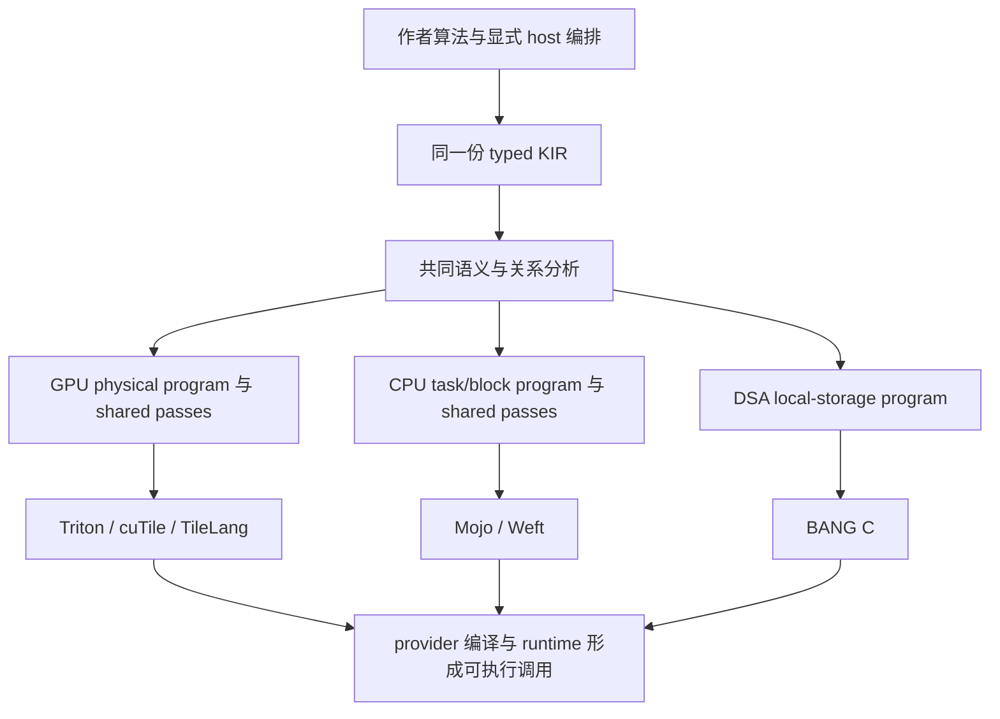

# IntentDSL 开源可用性与编译器能力调研

调研日期：2026-09-30。范围：基于当前代码、既有运行证据和成熟参考实现，调查产品可用性、agent/MCP、跨执行模型与资源感知，提出后续计划。本轮不修改实现、规格、README 或实验结果，不启动新 benchmark。

## 1. 判断：继续完善现有编译器，同时建立真实的公开使用入口

**IntentDSL 已经有真实编译器和跨执行模型的共同价值，尚未成为外部开发者能顺畅安装、使用、诊断并扩展的成熟工具。当前最值得投入的不是继续增加 benchmark 覆盖数量，而是安装与调用闭环、合法写法的编译稳定性、共享分析的积累，以及目标能力判定和物理变换的可维护性。**

这不是“论文结果足够好，所以产品也好了”的结论。当前证据支持以下分层判断：

| 问题 | 当前结论 | 尚不能据此声称什么 |
|---|---|---|
| 是真实编译器吗？ | 是。已有 typed KIR、不同 execution family 的物理程序、改变 SSA/loop/access/storage 的变换、provider 编译与真实运行链路 | 合法程序已全面覆盖、任何写法都稳定高效 |
| 只是统一前端吗？ | 不是。已有跨 GPU/CPU/DSA 的共用语义分析，GPU providers 共用 physical passes，Mojo/Weft 共用 CPU pipeline | 所有优化已经跨 family 共享，或新增后端成本很低 |
| 真的是 JIT 吗？ | 是 Python 运行期编译与 provider JIT 的组合，Triton 路径确实 launch 生成的 kernel | `@intent.kernel` 已具有透明直接调用体验，或 `intent.compile()` 返回前完成全部 native JIT |
| 已能被别人安装使用吗？ | 研究环境中能用；标准 Python 包、依赖交付、独立 MCP、普通使用教程尚不完整 | 当前 README 已足以让陌生用户在新环境成功使用 |
| 跨代只变 Triton config 吗？ | 不是。资源已能影响 grid-stride traversal、部分数值实现和 contraction/access forms | 已建立精确 occupancy/cost model，或 H100/5090D 每次都应生成不同源码 |
| 会退化成算法库吗？ | 所核查主路径没有 whole-operator 名称分派证据；局部 typed primitive/micro-kernel 是合理组成 | 所有复合 matcher 都足够通用，或 DSA 的分层已经清楚 |

本报告基于 2026-09-30 的 `main` 工作树。开始时工作区干净；本轮只新增此报告。代码理解先使用已有 Codegraph，再补读具体文件；参考为本地 `../ref/triton`、`../ref/tilelang` 与下文链接的一手官方文档。**没有新安装、编译、设备运行或性能测量。** 历史 CSV 只用于解释已经发生的问题，不作为当前代码的新性能结论；本地参考源码也不假定与历史实验安装包逐行相同。

## 2. 应该承诺什么样的统一能力

### 2.1 统一算法事实，不统一所有物理拓扑

当前边界是成立的：作者定义算法、数值合同、逻辑状态和 kernel/host 编排；compiler 选择不改变这些语义的执行组织。KIR 不携带设备分支；GPU、CPU、DSA 可以产生不同物理程序。它们应复用关系、依赖、effect、identity、bounds 与局部计算语义，而不是共享一套换名字的 GPU thread/block 模型。依据：[编程模型](/home/kingdom/phdworks/intentdsl/doc/programming-model/README.md:20)、[kernel/host 边界](/home/kingdom/phdworks/intentdsl/doc/programming-model/kernel-and-host.md:15)、[编译器边界](/home/kingdom/phdworks/intentdsl/doc/compiler/README.md:20)。

图表示实际主链路，不表示三条分支已经同样成熟。尤其 DSA 的 construction 与后续优化尚未像 GPU/CPU 那样分开，见第 6 节。

相对于直接写多个编译器的 source，Intent 应提供三项可以独立检查的价值：

1. **作者复用**：修改一份算法定义，多个后端保持同一逻辑合同，不再分别维护算法实现。
2. **编译知识复用**：某项 coordinate/identity/dependence 证明只实现一次，由不同物理程序消费；后端内的 mapping、blocking、reuse 也能跨多个算法使用。
3. **物理程序构造**：作者没有写的 program ownership、fragments、访问、存储和遍历由 compiler 形成，然后交给成熟下层编译器。

第三项是 Intent 比普通 Triton source 更高层的责任，也是风险所在。Triton 作者本来就写 program id、tile、部分 traversal 和 host launch。官方 persistent matmul 示例明确由 host 读取 SM 数，并在 kernel 中写 persistent loop；Intent 自动形成这一类结构具有独立价值，但不能因此接管算法选择或隐藏的多 kernel 编排。[Triton 官方 persistent matmul](https://triton-lang.org/main/getting-started/tutorials/09-persistent-matmul.html)

### 2.2 高性能承诺应有边界，但不能用边界掩盖实现问题

同一个算法未必适合所有执行模型。若作者写了严格顺序依赖，或把一个全局归约限定为单 kernel，compiler 不能靠自动更换算法、引入隐藏 launches 来保证最优性能。另一方面，语言允许的 reshape、helper、标量/张量表示、合法索引等写法差异，如果没有改变算法与数值合同，却让 ownership 丢失或产生大量重算，仍是我们的编译器问题。

因此目标应是：**在已支持的算法与语义范围内，让多种合法表达可靠地落到高质量物理程序；明确暴露无法兑现的目标组合及其原因；逐步扩大这套能力的适用范围。** “任意算法、任意后端、自动达到专家最优”不是可验收的目标；“所有掉速都要求作者改写”同样不能接受。

判断一种融合是否越权，先对照合同与成熟实现。局部 producer/consumer、multiply-reduce→contract、dot+add→accumulator 可以是合法编译变换；改变 ordered recurrence、跨数值 cast、重写 host kernel 数量不是同一回事。当前规格已明确这些界限：[允许与禁止的变换](/home/kingdom/phdworks/intentdsl/doc/compiler/passes-and-analyses.md:139)。

## 3. 安装、JIT、PyTorch 与 README：真实能力和交付缺口

### 3.1 当前安装仍面向仓库维护者

根目录文件盘点未发现标准 Python 构建入口 `pyproject.toml/setup.py/setup.cfg`，也未发现根目录 `LICENSE/COPYING` 或 `.github` 发布配置。这是本仓库当前状态，不代表已经调查所有外部发布渠道。

[README](/home/kingdom/phdworks/intentdsl/README.md:1) 提供环境要求、手工 CMake 和实验执行，但没有普通用户安装 Intent Python 包并调用一个算子的完整路径。[实验脚本](/home/kingdom/phdworks/intentdsl/experiments/run.sh:30) 默认引用 `/home/kingdom/.venvs/`，并在 [105 行附近](/home/kingdom/phdworks/intentdsl/experiments/run.sh:105) 注入仓库相关 `PYTHONPATH`。这些是可以继续用于内部实验的入口，不能承担公开安装合同。

安装还缺两项容易被忽略的内容：

- **Python MLIR bindings**：frontend 必经 [canonicalization](/home/kingdom/phdworks/intentdsl/python/intent/frontend/compilation/compiler.py:57)，实际导入 [`mlir.dialects`/`mlir.ir`](/home/kingdom/phdworks/intentdsl/python/intent/frontend/mlir/builder.py:381)。README 的 MLIR CMake package 要求和 `environment/*.txt` 没有给出这项 Python 依赖的安装闭环。静态上可确认“所列依赖不足以保证成功”，本轮未创建新环境复现。
- **compiler 配套资源**：[CMake](/home/kingdom/phdworks/intentdsl/tools/intent-compile/CMakeLists.txt:8) 把 shared/provider profiles 放到可执行文件旁的 `profiles/`。只打包 `intent-compile` 不够，还要处理 Python 包、MLIR bindings、可执行文件依赖和这些资源。

Triton 的标准构建入口与安装说明已经把普通 wheel 使用和源码开发分开，见 [参考 pyproject](/home/kingdom/phdworks/ref/triton/pyproject.toml:1)、[参考安装文档](/home/kingdom/phdworks/ref/triton/docs/getting-started/installation.rst:11) 和[官方安装入口](https://triton-lang.org/main/getting-started/installation.html)。我们应先建立同等完整的用户路径，再逐步改善分发便利性。

**建议首条公开路径收敛为 Linux + NVIDIA + Triton。** 这是交付优先级建议，不删除其它后端。先让这一条从干净环境到真实算子调用完整成立；cuTile、Mojo/Weft、BANG C 的工具链安装分别提供明确入口和支持边界。不要发一个能 `pip install`、但运行仍必须依赖维护者私有目录的包。

### 3.2 JIT 链路已存在，缺的是体验和清楚的阶段合同

| 阶段 | 当前代码事实 |
|---|---|
| 定义 | [`@intent.kernel`](/home/kingdom/phdworks/intentdsl/python/intent/api/definitions.py:53) 产生 definition，直接调用要求先 compile |
| Intent 编译 | [`intent.compile`](/home/kingdom/phdworks/intentdsl/python/intent/compiler/pipeline.py:16) 进行 frontend、目标解析、C++ compiler 调用和 materialization；当前 `compiler` 必填 |
| 编译缓存与诊断 | [`toolchain`](/home/kingdom/phdworks/intentdsl/python/intent/compiler/toolchain.py:49) 已提供编译产物复用、阶段错误与日志路径 |
| 加载生成程序 | [`runtime/source.py`](/home/kingdom/phdworks/intentdsl/python/intent/runtime/source.py:23) 真正 compile/exec provider Python source，绑定 launch/run |
| 底层 JIT 与 launch | Triton serializer 发出 [`@triton.autotune`/`@triton.jit`](/home/kingdom/phdworks/intentdsl/lib/Target/Triton/Serialization/Serializer.cpp:577)，并真正调用 [`_intent_kernel[grid]`](/home/kingdom/phdworks/intentdsl/lib/Target/Triton/Serialization/Serializer.cpp:837) |
| 普通调用 | [`artifact.run`](/home/kingdom/phdworks/intentdsl/python/intent/runtime/artifact.py:74) 和 artifact callable 已存在，包含 Torch tensor/device 处理 |

准确的公开说法是：Intent 在 Python 运行期把算法 definition 编译成 callable artifact，再由 provider 完成其 JIT 和执行。首次 `compile`、首次调用的 native JIT/tuning、缓存命中后的调用是不同成本，不能把论文热态算子时间当作首次使用延迟。

下一步应先提供默认 compiler 定位、保留开发者显式 override、给出 compile-once 的普通 host wrapper。**不必为证明“我们是 JIT”另造一套 `@intent.jit` 编译路径。** 若以后需要透明惰性 specialization，它也应包装同一 definition→compile→artifact 路径。

### 3.3 接收 Torch tensor 不等于已完整融入 PyTorch

当前 `python/` 中未找到 `torch.library`、`register_fake/register_autograd`、`triton_op/wrap_triton` 或正式 `torch.compile` adapter。已有 eager tensor 互操作是真实能力，但不能据此承诺无 graph break、FakeTensor、autograd、export 或所有 CUDA Graph 生命周期都已支持。

应把公开能力拆为：eager callable → 明确 output/mutation schema 的框架 adapter → 所选 `torch.compile`/FakeTensor 组合 → 作者 backward 注册。跨 provider 可以研究 opaque `custom_op`；Triton 路径可以研究可被追踪的 `triton_op/wrap_triton`。二者能力不同，不能用一个包装器名字宣称所有目标都完成集成。官方接口的这一区别见 [PyTorch 教程](https://docs.pytorch.org/tutorials/recipes/torch_compile_user_defined_triton_kernel_tutorial.html) 与 [`torch.library`](https://docs.pytorch.org/docs/main/library.html)。

这部分的完成标准是用户能把已选的 Intent callable 放入实际模型调用，并知道哪些框架组合已经兑现；不是新增自动求导编译器，也不是只让 import 成功。

### 3.4 README 与教程应围绕第一次成功使用

[examples/README](/home/kingdom/phdworks/intentdsl/examples/README.md:3) 当前把运行指向实验组；[DSL examples](/home/kingdom/phdworks/intentdsl/doc/dsl/examples/README.md:1) 明确是理想化语义示例。两者都不能直接当作完整 quickstart。可以复用已有 [softmax 算法](/home/kingdom/phdworks/intentdsl/examples/kernels/normalization/softmax.py:23) 及其 [真实 provider 接入](/home/kingdom/phdworks/intentdsl/experiments/gpu/providers/triton/normalization.py:30)，避免另写一套相似算法。

Triton 第一篇教程把 kernel、输出分配、host wrapper、Torch 调用放在一起，参见 [本地源码](/home/kingdom/phdworks/ref/triton/python/tutorials/01-vector-add.py:29) 和 [官方教程](https://triton-lang.org/main/getting-started/tutorials/01-vector-add.html)。应学习这种完整路径，而不是把 Triton 的 tile/grid surface 搬给 Intent 作者。

建议 README 保留以下顺序：一句话定位与边界、一张工作流图、真实支持平台、安装、一个完整调用、同 source 换 target 的入口、MCP 接入、深入教程/论文链接。首页不堆所有 pass、所有实验表和全部后端环境说明。

本轮已实际查看论文的 [fig1-v2](/home/kingdom/phdworks/intent-paper/paper/fig/fig1-v2.pdf) 与 [fig3](/home/kingdom/phdworks/intent-paper/paper/fig/fig3.pdf) 渲染：前者右侧 workflow 适合简化成首页图，后者适合深入解释 execution family，密度不适合首次使用入口。前者的可编辑源在 [`fig1-v2.svg`](/home/kingdom/phdworks/intent-paper/01-引言与整体定位/fig1-v2/svg/fig1-v2.svg)。后续制作 README 时复制必要资源进入本仓库，并按实际支持范围校正图中文字；不依赖相邻论文 checkout。

教程先提供少量有递进关系的完整调用：普通 tensor/归约、作者显式多 kernel 编排、一个 structured algorithm。同一算法定义继续复用 `examples/kernels/`；host 教程不复制 registry、baseline 或 benchmark runner，也不把固定题集里的硬编码 submission 直接包装成通用 API。

## 4. Agent/MCP：从评测接入变成日常工具

### 4.1 已有基础值得保留

[`manual.py`](/home/kingdom/phdworks/intentdsl/python/intent/tools/manual.py:43) 从公开语义文档和 API 声明构建 corpus；[`api`](/home/kingdom/phdworks/intentdsl/python/intent/tools/manual.py:266) 返回精确声明、规则及来源，明确声明不等于后端/性能保证；[`read`](/home/kingdom/phdworks/intentdsl/python/intent/tools/manual.py:285) 提供稳定材料入口；[MCP server](/home/kingdom/phdworks/intentdsl/python/intent/tools/manual.py:324) 暴露只读 search/api/read。这比只向 agent 塞一大份 README 更有用。

主要缺口在接入和反馈：server [强制要求 `--corpus`](/home/kingdom/phdworks/intentdsl/python/intent/tools/manual.py:316)，材料生成及 client 配置在 [实验 agent](/home/kingdom/phdworks/intentdsl/experiments/agent_tritonbench/agent.py:77) 中，还带 `context.compile` 的评测接口；environment 文件未给出 MCP 依赖安装。公共用户缺少独立安装、启动配置和清楚的起点。

已有首次记录中的 `asin` 未提交，agent 自述找不到所需 MCP/API，见 [h100-low.csv](/home/kingdom/phdworks/intentdsl/experiments/agent_tritonbench/results/h100-low.csv:3)。这能证明该次使用没有形成有效工具路径，**不能仅凭自述断言 server 宕机或精确归因**；后续独立提交通过也不能回写首次成绩。

### 4.2 后续应形成的使用闭环

1. 安装后可直接启动公共 manual MCP，材料随产品可用；普通客户端不需要先运行实验 driver。
2. 入口告诉 agent 怎样发现语言、查询 API、确认语义和查看完整公开教程。保持真实 API 声明、源码定位与文档的一致性。
3. 在只读 manual 之外，提供用户主动启用的编译诊断能力：输入当前程序和 target，返回失败阶段、source location、相关 operation/type、目标限制和 artifact 路径。编译成功与运行正确分开报告。
4. 正常产品开发允许生成、编译、读取诊断、修正；固定 agent 实验继续一次正式提交。两者不共用成绩口径，也不让评测协议限制真实工具体验。

当前 [错误收集](/home/kingdom/phdworks/intentdsl/python/intent/tools/manual.py:84) 仅扫描部分 frontend lowering 字符串，不是完整 compiler 诊断知识库。应复用 [toolchain 已有阶段分类](/home/kingdom/phdworks/intentdsl/python/intent/compiler/toolchain.py:18)，而非再建一套与真实编译器脱节的问答系统。

完整公开示例应放普通教程/examples，当前 manual MCP 继续只含通用语法、语义和必要最小片段。若将来希望 MCP 直接检索完整算法，应明确改变这项边界，并与固定评测材料隔离；本报告不把用户提到“示范例子”解释为已经授权改变现有手册合同。

## 5. GPU 跨代与资源感知：已经有什么，还缺什么

### 5.1 同一 Triton provider 并非只调整 config

资源信息的实际路径是：[CUDA 设备查询](/home/kingdom/phdworks/intentdsl/python/intent/targets/gpu/device.py:36) → [GPUCapabilities](/home/kingdom/phdworks/intentdsl/tools/intent-compile/intent-compile.cpp:278) → [physical kernel typed attribute](/home/kingdom/phdworks/intentdsl/lib/Conversion/KIRToGPU/KIRToGPU.cpp:5630) → shared passes → [provider legalization](/home/kingdom/phdworks/intentdsl/tools/intent-compile/intent-compile.cpp:300)。查询包含 SM 数、shared memory、register file、thread limit、compute capability 和 FP32/FP64 吞吐比。

| 当前机制 | 代码中实际改变什么 | 应保留的限制说明 |
|---|---|---|
| Grid-stride/persistent traversal | [RefineProgramMapping](/home/kingdom/phdworks/intentdsl/lib/Dialect/GPU/Transforms/RefineProgramMapping.cpp:218) 按 computeUnits 绑定 resident workers，创建 `scf::ForOp` 并把 grid 缩为 `min(tasks, workers)` | 只对符合条件的 mapping；目前一 worker/SM，不是精确 occupancy 模型 |
| 允许证明的常数除法 | [EliminateCommonValues](/home/kingdom/phdworks/intentdsl/lib/Dialect/GPU/Transforms/EliminateCommonValues.cpp:238) 的部分 f32 路径要求 FP32/FP64 比值不高于 2，再构造 f64 cast/multiply/回转 | 受精确性条件约束，不是任意浮点重结合 |
| Retained contraction traversal | [RealizeContractionBlocking](/home/kingdom/phdworks/intentdsl/lib/Dialect/GPU/Transforms/RealizeContractionBlocking.cpp:2774) 根据最小结果 fragment 与 shared-memory 上限决定额外分块遍历 | 是结构预算启发式，不说明结果最终一定在 shared memory |
| Native dot 或乘加归约 form | [Triton Legalize](/home/kingdom/phdworks/intentdsl/lib/Target/Triton/Transforms/Legalize.cpp:2414) 消费 extent、精度、staging footprint/capacity，形成真实 IR 分支 | 形式合法不等于代价判断始终最优 |
| Descriptor form | [Triton Legalize](/home/kingdom/phdworks/intentdsl/lib/Target/Triton/Transforms/Legalize.cpp:853) 检查架构、access、alignment、容量并建立 typed descriptor/allocator | 当前覆盖 contraction 相关场景，不是所有 TMA 访问 |

因此 H100 和 5090D 可能形成不同的 Intent physical program；也可能形成相同的 Triton source，随后由 Triton 产生不同机器程序。**相同源码本身不是缺点；应判断这一差异是否必须由上层表达，以及下层是否已经能处理。**

### 5.2 Triton 怎样承担跨代差异

[NVIDIA compiler pipeline](/home/kingdom/phdworks/ref/triton/third_party/nvidia/backend/compiler.py:273) 在共同 TTGIR 上进行 coalescing、thread locality、matmul acceleration，再按架构选择 pipeline、warp specialization、TMEM 等序列。[AccelerateMatmul](/home/kingdom/phdworks/ref/triton/lib/Dialect/TritonGPU/Transforms/AccelerateMatmul.cpp:42) 不仅看代号，还检查 operation/shape/dtype：Hopper、数据中心 Blackwell、SM120 consumer Blackwell 的 MMA 路径不同；SM120 不能被视为 SM100 功能的超集。

[TargetFeatures](/home/kingdom/phdworks/ref/triton/include/triton/Dialect/TritonNvidiaGPU/IR/TargetFeatures.h:34) 还明确体现 feature 的非单调性。TileLang 同样按 target、storage scope、dtype/shape 和 threads 选择局部 GEMM lowering，见 [gemm.cc](/home/kingdom/phdworks/ref/tilelang/src/cuda/op/gemm.cc:80)、[target_utils](/home/kingdom/phdworks/ref/tilelang/src/cuda/target_utils.cc:71)；布局、pipeline 和 tile-op lowering 位于其 [CUDA pipeline](/home/kingdom/phdworks/ref/tilelang/tilelang/cuda/pipeline.py:100)。

应把“资源是不是 pass”拆为四件事：

| 内容 | 合适的职责 |
|---|---|
| 设备容量、primitive/dtype/cluster 支持 | target facts，不是 pass |
| 当前 fragment、lifetime、access 的需求估计 | analysis，可在 IR 改写后重算 |
| 决定 mapping、blocking、form 或候选集合 | policy，具有明确合法性和收益前提 |
| 真正修改 loop、SSA、type、access、storage | pass/coherent transformation group |

新架构特性只有在 Intent 必须形成不同 provider-source 结构时，才需要 Intent 的 pass 或 target-local extension。已由 Triton 完成的 MMA 指令选择、lane layout、TMA lowering、register allocation、pipeline scheduling 不重新实现。也不建立“一代 GPU 一个 dialect/pass”的系列。当前 [target 边界](/home/kingdom/phdworks/intentdsl/doc/compiler/README.md:35) 已支持这种组织。

### 5.3 当前最具体的能力缺口

**第一，feature 判定不够精确。** [device.py](/home/kingdom/phdworks/intentdsl/python/intent/targets/gpu/device.py:36) 当前查询 CUDA，`matrix_units=major>=7` 粒度较粗，不能从 Triton 自身支持 AMD 推导 Intent 已支持 AMD。更具体地，[Triton legalization](/home/kingdom/phdworks/intentdsl/lib/Target/Triton/Transforms/Legalize.cpp:4318) 以 major≥9 放行多 CTA，而 [Triton TargetFeatures](/home/kingdom/phdworks/ref/triton/include/triton/Dialect/TritonNvidiaGPU/IR/TargetFeatures.h:36) 排除 SM12x cluster ops。默认 [profiles](/home/kingdom/phdworks/intentdsl/lib/Target/Triton/Transforms/TuningProfiles.json:1) 的 ctas 都是 1，因此这是自定义候选或未来扩展可触及的静态 legality 漏口，不是本轮运行失败。

应为已有 consumers 补齐准确 feature predicates，并集中表达 provider/hardware 约束；不要为一个漏口创建无实际使用者的庞大 capability framework。

**第二，资源模型只是粗结构预算。** [归约 blocking](/home/kingdom/phdworks/intentdsl/lib/Dialect/GPU/Transforms/RealizeReductionBlocking.cpp:71) 比较 fragment words 与 register file；[配置物化](/home/kingdom/phdworks/intentdsl/lib/Dialect/GPU/Transforms/MaterializeConfigTuples.cpp:809) 逐 fragment 限预算，并承认逻辑 SSA liveness 不能代替下层布局与寄存器调度。加上前述一 worker/SM，目前不应宣传精确 occupancy 优化。改进应优先解决真实结构浪费，最终资源数据从下层编译结果解释，不复制其 allocator。

**第三，经验候选与能力建模混在宣传上容易误读。** [LocalOptions](/home/kingdom/phdworks/intentdsl/lib/Target/Triton/Transforms/Legalize.cpp:4274) 为 recurrent contraction 选择 Hopper/Blackwell profiles，具体候选在 [JSON](/home/kingdom/phdworks/intentdsl/lib/Target/Triton/Transforms/TuningProfiles.json:20)。这属于目标相关经验数据，合理但有限；不能替代 SM100/SM120 独立的 legality，也不能算作已经完成泛用成本模型。

## 6. 跨模型复用、leaf 与代码结构

### 6.1 已经成立的复用，不应被抹掉

| 复用范围 | 共同机制及实际消费者 | 说明 |
|---|---|---|
| GPU / CPU / DSA | [CanonicalKernel::indexRelation](/home/kingdom/phdworks/intentdsl/lib/Analysis/CanonicalKernel.cpp:235)；[GPU](/home/kingdom/phdworks/intentdsl/lib/Conversion/KIRToGPU/KIRToGPU.cpp:5476)、[CPU](/home/kingdom/phdworks/intentdsl/lib/Conversion/KIRToCPU/KIRToCPU.cpp:565)、[DSA](/home/kingdom/phdworks/intentdsl/lib/Conversion/KIRToDSA/KIRToDSA.cpp:830) 消费 | 共享 index terms、维度 identity 与 coordinate provenance；各自形成 fragment/access、memref loops 或 local-memory access |
| GPU / CPU / DSA | [UniformValueAnalysis](/home/kingdom/phdworks/intentdsl/lib/Analysis/UniformValues.cpp:195)；[GPU](/home/kingdom/phdworks/intentdsl/lib/Dialect/GPU/Transforms/RealizeRegionFold.cpp:1773)、[CPU](/home/kingdom/phdworks/intentdsl/lib/Dialect/CPU/Analysis/RegionPredicates.cpp:326)、[DSA](/home/kingdom/phdworks/intentdsl/lib/Conversion/KIRToDSA/KIRToDSA.cpp:2440) 接入 | 共享常量语义求值；CPU 需要额外 effect/alias 与 memory 解释，适配器不同是合理的 |
| GPU / CPU / DSA | [partitionCoordinatePredicate](/home/kingdom/phdworks/intentdsl/lib/Analysis/RegionSemantics.cpp:7)；[GPU](/home/kingdom/phdworks/intentdsl/lib/Dialect/GPU/Transforms/RealizeRegionFold.cpp:1745)、[CPU](/home/kingdom/phdworks/intentdsl/lib/Dialect/CPU/Transforms/RealizeRegions.cpp:232)、[DSA](/home/kingdom/phdworks/intentdsl/lib/Conversion/KIRToDSA/KIRToDSA.cpp:2448) 调用 | 相同区间规则导出 fully-valid/possible 区间，配合 identity 证明分别缩短 traversal 或跳过无贡献分段 |
| GPU providers | [shared transformation groups](/home/kingdom/phdworks/intentdsl/lib/Dialect/GPU/Transforms/Passes.cpp:206)，之后才分叉目标 legalization | ownership、blocking、region/reduction/contraction、access、buffer、mapping 不是每个 provider 各写一次 |
| Mojo / Weft | [共同 CPU 入口](/home/kingdom/phdworks/intentdsl/tools/intent-compile/intent-compile.cpp:234) 与 [CPU passes](/home/kingdom/phdworks/intentdsl/lib/Dialect/CPU/Transforms/Passes.cpp:161) | 共用 task/block、storage/input reuse、grouping、blocking 和任务划分；差别通过目标 implementation registry 注入 |

前三项是**共同分析、语义求值与证明规则**，不是三个完全相同的跨后端 rewrite pass。这个区别不会削弱价值：同一个作者坐标 predicate 的尾段只贡献 identity，可以在 GPU 上减少 fragment traversal，在 CPU 上减少 loop 区间，在 DSA 上避免相应 local-memory 搬运与计算；可迁移的是证明，执行变换应适合各自模型。

CPU 的复用也不是旁表记录：[ReusePreparedInputs](/home/kingdom/phdworks/intentdsl/lib/Dialect/CPU/Transforms/ReusePreparedInputs.cpp:383) 检查当前 supplies 的等价关系，真正改写 uses、去掉重复 producer/allocation，并调整 storage lifetime。这里能证明机制与共用代码路径存在，不能未经运行宣称所有 Mojo/Weft 算子都受益。

### 6.2 Leaf/micro-kernel 的存在不等于算法库化

CPU [Implementation 接口](/home/kingdom/phdworks/intentdsl/include/Intent/Dialect/CPU/Transforms/Implementation.h:44) 有 applicable、legal、parameters、formTile/expand 和 input requirements；[registry 选择](/home/kingdom/phdworks/intentdsl/lib/Dialect/CPU/Transforms/Implementation.cpp:31) 消费当前 operation/capability；[Mojo 实现](/home/kingdom/phdworks/intentdsl/lib/Target/Mojo/Transforms/Implementations.cpp:166) 依 contraction、dtype、资源选择局部实现。外层 CPU passes 仍负责分块、供数和复用。

GPU 的 [Triton serializer](/home/kingdom/phdworks/intentdsl/lib/Target/Triton/Serialization/Serializer.cpp:1237) 消费已经形成的 contract/reduce/scan，映射到 `tl.dot/dot_scaled/reduce/associative_scan`；[TileLang bufferization](/home/kingdom/phdworks/intentdsl/lib/Target/TileLang/Transforms/Bufferize.cpp:1855) 形成局部 GemmOp。这些是明确 typed 计算块的实现，不是按 attention 等整个算子身份替换程序。

成熟目标也如此：[TileLang GEMM](/home/kingdom/phdworks/ref/tilelang/src/op/gemm.cc:188) 接收 target/layout/thread bounds，把局部实现 body 嵌入当前 IR；[LowerTileOp](/home/kingdom/phdworks/ref/tilelang/src/transform/lower_tile_op.cc:1134) 通过资源/布局回调继续展开。差异在于 TileLang 作者已经写下较多物理组织，Intent 作者没有写，所以 Intent 不能把缺失的外层组织甩给 leaf 猜。

判断库化风险时应看四个问题：

- 匹配依据是局部 operation 的完整语义，还是整个 kernel 的名字/任务身份？
- 局部实现是否由当前 operands、relations、dtype 和能力合法实例化？
- 外层控制、访问、state、kernel 数量仍由当前程序决定吗？
- 同一 leaf 能否作为其它算法的局部组成，还是接管了完整算法？

不应以“用了专家代码”“存在 shape 约束”或“最初只优化一个例子”直接否定编译器性质。相反，如果每个新任务都要在 construction、matcher、serializer 三处增加平行特例，即使没有调用任何外部库，仍然是严重的可扩展性问题。

### 6.3 当前结构债务是具体的

**DSA 的阶段边界最弱。** [CLI](/home/kingdom/phdworks/intentdsl/tools/intent-compile/intent-compile.cpp:222) 直接走 KIRToDSA→BANG C legalization→serialization；[construction 结束](/home/kingdom/phdworks/intentdsl/lib/Conversion/KIRToDSA/KIRToDSA.cpp:4144) 后主要做 verify，没有 GPU/CPU 那样的 current-program transformation pipeline。

更具体地，[KIRToDSA](/home/kingdom/phdworks/intentdsl/lib/Conversion/KIRToDSA/KIRToDSA.cpp:3866) 在 construction 内依 shape、local bytes、tasks 等选择四计算核协作；[3905 行附近](/home/kingdom/phdworks/intentdsl/lib/Conversion/KIRToDSA/KIRToDSA.cpp:3905) 写入 `bangc.layout="matrix_filter_interleaved64"`；[3947 行附近](/home/kingdom/phdworks/intentdsl/lib/Conversion/KIRToDSA/KIRToDSA.cpp:3947) 写入 `bangc.implementation="matmul_local_f32_accumulator"`。同一阶段还建立 double buffer/pipeline/synchronization。这不是按名字选算法，但已混合 family construction、资源策略和 BANG C realization。新 DSA 硬件不能指望只换配置就获得泛化。

后续应按职责把 cooperation、storage/pipeline、目标 implementation selection 迁到相应 current DSA IR 变换，保留完整初始程序并逐阶段验证；不是按文件长度拆目录。当前 [compiler 规格入口](/home/kingdom/phdworks/intentdsl/doc/compiler/README.md:9) 也主要列 GPU/CPU，缺少 DSA 对等章节。相关设计需先明确并由用户确认，再完善正式规格，本轮不擅自补写。

**GPU 关系维护耦合较重。** [Passes.cpp](/home/kingdom/phdworks/intentdsl/lib/Dialect/GPU/Transforms/Passes.cpp:52) 多次串联 align/refresh；[RealizePointwiseBlocking](/home/kingdom/phdworks/intentdsl/lib/Dialect/GPU/Transforms/RealizePointwiseBlocking.cpp:4301) 内部又串联多轮 aggregate/access/pointwise/contract relation 修复。重复调用是维护压力的证据，尚不是“这些调用可直接删除”的证明。应追踪每项 rewrite 改坏/失效了哪些 facts，把维护归入有清楚 postcondition 的变换或 mutation API，再去掉确证冗余。

**复合代数知识存在分叉。** [canonical OnlineSummary matcher](/home/kingdom/phdworks/intentdsl/lib/Analysis/OnlineSummary.cpp:96) 被 [DSA](/home/kingdom/phdworks/intentdsl/lib/Conversion/KIRToDSA/KIRToDSA.cpp:2595) 使用；[GPU OnlineSummary](/home/kingdom/phdworks/intentdsl/lib/Dialect/GPU/Transforms/OnlineSummary.cpp:201) 另行识别物理图。适配不同 dialect 合理，但同一套 validity/max/mass/moment 关系各自维护，容易使合法性修复只落在一边。应优先共享代数关系与合法性分析，保留各自 physical rewrite；不新造“万能 attention plan”。

**这条乘法归约规范化尚未成为跨 family 共用路径。** [multiply-reduction normalization](/home/kingdom/phdworks/intentdsl/lib/Dialect/GPU/Transforms/RealizeContractionBlocking.cpp:6134) 由 [GPU group](/home/kingdom/phdworks/intentdsl/lib/Dialect/GPU/Transforms/Passes.cpp:29) 调用；这不排除 CPU 自身规范化存在其它等价机会。它是复用候选，但不能机械搬到 immutable KIR 上。先共享 typed algebra/coordinate 分析，再由不同 family 改写 current IR；若要增加 KIR 前规范化阶段，应单独明确语义与 authority。

## 7. “换一种写法就变弱”：已有证据怎样归因

### 7.1 历史中确有编译器自身造成的大幅差距

下表来自已有 [h100-low.csv](/home/kingdom/phdworks/intentdsl/experiments/agent_tritonbench/results/h100-low.csv:1)，是同一批首次记录与 development 记录的摘录，不是当前代码重测，也不把 development 算成首次生成成功。

| 程序 | 原记录 / development 时间（ms） | 记录与 source 支持的归因 |
|---|---|---|
| fused_mv_sigmoid_sub | 0.186352 / 0.013616 | [同一原提交复测](/home/kingdom/phdworks/intentdsl/experiments/agent_tritonbench/results/h100-low.csv:51)；记录指向 scalar producer projection/row ownership 修复 |
| normalize_pairwise_distance | 3.531768 / 0.009664 | [同一原提交复测](/home/kingdom/phdworks/intentdsl/experiments/agent_tritonbench/results/h100-low.csv:154)；记录指向先保留完整 reduction fibers 再 blocking |
| exp_mean | 0.064968 / 0.027136 | [独立新提交](/home/kingdom/phdworks/intentdsl/experiments/agent_tritonbench/results/h100-low.csv:40)；从一个 kernel 改成显式 exp、mean 两个 kernels，不能归为单纯等价语法规范化 |

本轮读过前两项原 submission：前者是 matmul→reshape→sigmoid→逐行写出；后者先计算整域距离/归一化 tensor，再在 `I.parallel` 中索引写出。它们暴露的是 compiler 必须正确保持 producer/free-axis/reduction ownership 的问题。原提交文件路径可由 CSV 的 `intent_program` 字段定位，未复制到新 corpus。

本轮也读过 `exp_mean` 两份程序：首次完整 exp+reduce 在一个 kernel；后续由 host 分配中间 tensor 并调用两个 kernel。因此即使外部数学结果相同，host-visible 程序组织已经改变。该差距不能用来要求 compiler 自动拆 kernel，也不能用“作者改写后快了”掩盖其它明确的 lowering 问题。

这些历史观察支持认真治理性能断崖，但不证明这些问题仍在当前代码，也不证明所有 agent 掉速来自同一个 matcher。本轮没有新的“同编译器、同输入、两种等价写法”配对运行。

### 7.2 当前实现为什么仍可能对表达形态敏感

正面机制已经存在：[`I.dot/matvec/vecmat/matmul`](/home/kingdom/phdworks/intentdsl/python/intent/frontend/lowering/intrinsics/matrix.py:15) 归一到共同 `emit_contract`，不是每个 surface 名称都建独立 backend 路径；[GPU structured normalization](/home/kingdom/phdworks/intentdsl/lib/Dialect/GPU/Transforms/RealizeContractionBlocking.cpp:6396) 也已经处理部分乘法归约与 contraction 关系。

但 online-summary 优化仍有明显窄边界：[matcher](/home/kingdom/phdworks/intentdsl/lib/Dialect/GPU/Transforms/OnlineSummary.cpp:201) 要求恰好四字段、特定 validity/max/mass/moment 关系；[后续匹配](/home/kingdom/phdworks/intentdsl/lib/Dialect/GPU/Transforms/OnlineSummary.cpp:253) 依赖特定 select、exp/exp2、subtract 和 cast/contract 连线；[普通 online reduction](/home/kingdom/phdworks/intentdsl/lib/Dialect/GPU/Transforms/RealizeOnlineReduction.cpp:74) 还要求入口 block 的形态。[miss 时](/home/kingdom/phdworks/intentdsl/lib/Dialect/GPU/Transforms/RealizeOnlineReduction.cpp:360) 跳过该优化。它使用真实 typed graph，不是按 kernel 名称，但字段扩展、不同 select 组织或嵌套位置可能使优化资格变化。

窄 matcher 本身并非错误。Triton 的 [Combine.cpp](/home/kingdom/phdworks/ref/triton/lib/Dialect/Triton/Transforms/Combine.cpp:135) 同样用 rank、reduction axis、broadcast 和尺寸条件识别 mul+sum→dot；[dot+add](/home/kingdom/phdworks/ref/triton/lib/Dialect/Triton/Transforms/Combine.cpp:249) 也要求零初值和 single use。但 Intent 把更多物理选择从作者移给 compiler，因此需要更强的规范化与可解释性，不能用 Triton 也有 matcher 为所有性能断崖免责。

建议把后续处理分成三类：

| 差别 | 处理责任 |
|---|---|
| 同语义的 helper、坐标映射、reshape/broadcast、纯表达式组织 | 尽量保留共同 facts、规范化到等价局部结构；未优化时给出具体原因 |
| 额外 cast、accumulator 精度、NaN/identity、ordered control/effects 不同 | 先核对语义，不强制统一执行结果或匹配资格 |
| kernel 数量、中间 ABI、分段算法或 host 编排不同 | 作者算法选择；compiler 可解释代价，但不默认自动更换 |

“优化沉淀”不应只是新增一个命中特定图的分支。每次修复应回答：丢失的事实是什么、可共享的规则是什么、哪些 current-IR users 需要同步改写、哪部分确实目标专属。第一轮就从现有 agent/production 中已经暴露的关系问题着手，不另造一套抽象等价测试矩阵。

## 8. 推进计划：两条工作线，按可交付结果收束

建议产品可用性与编译器稳定性并行。产品线不等待所有后端重构完成；编译器线也不以 README 上线代替能力进展。下面是工作包与依赖顺序，不是新增审批流程；具体实现仍需用户后续授权。

### 第一批：让别人真正用起来，同时修正最明确的能力合同

| 工作包 | 要交付的实际变化 | 依赖与完成标准 |
|---|---|---|
| A1 安装闭环 | 标准 Python packaging；MLIR bindings、compiler、profiles 的安装与定位；Triton 路线依赖脚本；保留显式开发 override | 新环境按文档安装，离开 checkout 后能 import、compile、调用已有生产算子；不依赖私人路径或实验 driver |
| A2 公共调用与 README | compile-once 的普通 Torch wrapper；说明首次 compile/调用/tuning/cache；一个完整 quickstart；简化论文 workflow 图；准确支持范围 | A1 的真实路径跑通后写入 README；复用现有算法和容差，不提供无法运行的展示代码 |
| A3 独立 MCP | 包内公共 corpus 与依赖；独立启动和客户端配置；清楚的发现/API/语义入口 | 普通 agent 客户端能实际连接并查询公共接口，无需 `ProgramContext` 或实验材料生成器 |
| B1 目标能力合同 | 修正现有 capability consumers 的明确漏口，优先多 CTA/SM12x；分清 legality 与 profile；暴露已有 device facts | 有足够信息时提前拒绝不支持组合；使用现有受影响生产入口验证；不凭默认候选没触发而保留错误判定 |

**第一批的主交付应是 A1+A2+A3，而不是继续全量刷算子。** B1 可独立并行，范围限定为已经定位的目标合同；不顺带启动大规模资源模型重写。README 首屏选择 Triton 路线，不代表其它后端的既有运行证据被取消。

### 第二批：让写法和优化决定更可靠、更容易解释

**B2：从当前 current-IR 关系维护入手治理性能断崖。**

- 从现有程序中选择已有的 producer projection、reduction/free-axis ownership、reshape/broadcast 相关问题链；先核对 source 数值/effect/host 合同。
- 追踪 normalization→ownership→blocking→structured realization 的真实 IR，找出失去 facts 或过早固定物理结构的位置。
- 修改正确层的分析与 rewrite，让合法表达复用同一机制；把必要关系维护收回 coherent transformation，不在 serializer 再补猜测。
- 在既有 production/agent 开发入口上跑必要的原容差与完整算子计时，原位更新既有开发结果。历史首次结果不改，不创建平行结果表。

完成标准不是“增加了几个 pass”，而是受影响的原程序无需改算法，物理结构问题消除；其它已存在且适用的程序能复用该规则。若只修了一个 shape，应如实说明已验证范围。

**A4/B3：把现有诊断与编译产物变成用户能理解的接口。**

复用已有错误阶段、source location、physical IR、generated source、cache directory；增加必要的优化资格/未采用原因与所用目标事实。例如“因何不能用 descriptor”“某 reduction 的 free axis 为何不能打包”“为何选择当前 traversal”。说明依据来自哪层，避免把性能猜测当事实。下层编译结果中的 registers/shared memory 可用于解释；冷编译、tuning、热态 kernel 时间分别呈现。

这些能力可以先作为普通 CLI/Python 诊断，再由独立 MCP 工具调用；不在只读 manual 中混入动态编译动作。不另建一套脱离当前 IR 的 plan authority。

### 第三批：把可迁移优化知识沉淀好，补齐较弱的 execution family

| 工作包 | 具体范围 | 完成标准 |
|---|---|---|
| B4 共享语义证明 | 在现有 `lib/Analysis` 上逐项共享 coordinate/identity/代数合法性；优先 online-summary 重复关系及数学规范化的共同部分 | 至少两个真实消费者使用同一规则；各 family 仍改写自己的完整 current IR；不以包装同名函数冒充复用 |
| B5 DSA 分层 | 先明确初始 DSA executable program；把 cooperation、storage/pipeline 与 BANG implementation/layout 选择分开 | 可在阶段边界看到完整程序及验证；目标细节不再由 KIR construction 直接猜；保留单一路径，用已有 MLU registry 核查 |
| B6 资源决策改进 | 对已观察的结构瓶颈改进 footprint/lifetime/reuse 估计；准确 feature predicates；有限合法候选 | 能解释相同 KIR 在 H100/5090D 的上层异同，以及哪些差异由 Triton 完成；不要求源代码必须不同，不重建下层 allocator |

B4 应按真实重复逐项提取，不建立一个大而全的跨模型 scheduler。B5 涉及尚未完整沉淀的 DSA 设计，实施前需要用户确认职责变化及规格补充。B6 以已有资源消费者和生产瓶颈为驱动，避免先堆“architecture pass”再寻找用途。

### 第四批：扩大产品集成与外部贡献能力

完成 A1 的基础后可与第二、三批并行推进，具体按用户使用需求排序：

- **PyTorch adapter**：先选定 eager、`torch.compile`/FakeTensor、mutation/output schema 的具体支持范围；用已有算法 callable 接入。Backward 由作者定义或注册，不默认自动发明。
- **更多后端安装与分发**：cuTile、CPU 与 MLU 分别提供依赖获取、安装、定位、错误诊断；从可重复源码安装走向普通用户二进制交付。不把所有后端放进一个必须全部安装的巨型环境。
- **少量完整教程与贡献入口**：讲清如何新增一个算法、一个已有 primitive 的目标实现、一个具合法性前提的变换。以真实代码边界指导贡献，不要求每位作者阅读所有内部 IR。
- **公开发布条件**：根许可证和已有 baseline/第三方材料的分发边界需要明确；许可证选择由维护者决定。本轮不替用户选许可证或发布，也不新增版本号、CHANGELOG 或迁移指南。

### 8.1 如何判断我们是在成长，而不是继续堆样例

后续每个连贯改动用以下实际问题收束，不建立额外报告或独立测试体系：

1. 外部用户能否从安装到调用成功，还是仍需要维护者提供私有环境？
2. 新的合法程序是否主要复用已有语义/分析/family passes，还是又要在多层加同一个任务的特例？
3. 一个优化的合法性规则是否被真正共享，目标专属部分是否范围清楚？
4. 性能差距能否定位到当前物理结构、provider 能力或测量合同，而非笼统归因“后端太弱”？
5. 交付是否分别说明生成成功、编译成功、运行正确与性能观察，而不是混成一个“支持”？

验证继续使用既有生产 registry、既定输入与容差、对应实验组的既有结果输出；不新增独立数值/边界/压力测试矩阵，不为了产品化重新跑整套论文实验。同一改动完成必要检查后继续交付，不用验证次数代替实现进展。

## 9. 本轮结论的限制与下一步起点

本轮已完成代码/规格/参考对照、安装与 MCP 入口盘点、历史个例核查和两张论文图的渲染查看；没有声称新环境安装成功，也没有声称当前 compiler 在新的表达或设备组合上通过运行。

最有价值的下一步是启动第一批产品交付，并在编译器线上完成 B1、进入 B2。当前证据不支持推倒整个架构，也不支持直接宣布已经达到 Triton 的成熟度。我们已经拥有可继续积累的算法语义、共享证明与物理编译骨架；接下来要让这些能力不再依赖维护者的机器、特定写法和对内部流程的熟悉程度。
